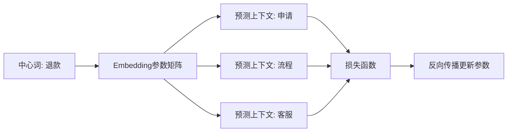
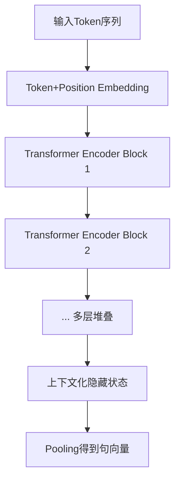
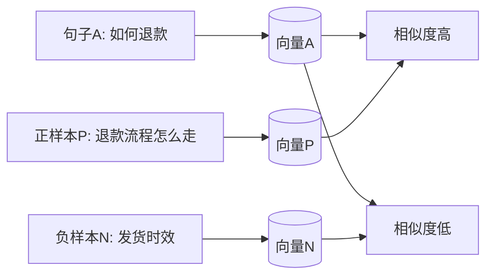
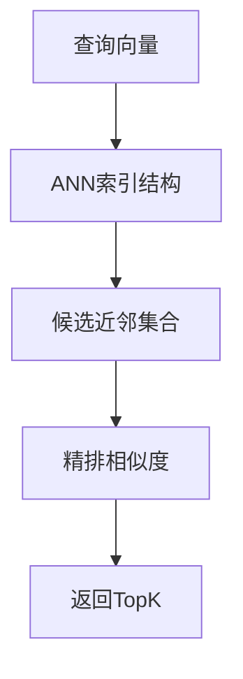
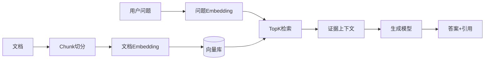

# Embedding 深入讲解（底层原理 + 原理图）逐页讲稿

> 文档用途：直接用于 PPT 制作与现场讲解
> 受众：零基础到初级工程师
> 建议时长：60~90 分钟
> 版本：v1.0

---

## 使用说明

1. 每一页都按「页标题 + 关键点 + 讲解词 + 图表」组织。
2. 你可以直接把每页标题做成 PPT 标题。
3. Mermaid 图可直接贴到支持 Mermaid 的编辑器中渲染。
4. 如果时间不够，优先讲第 1~12 页和第 16 页。

---

## 第1页：封面

**标题**：Embedding 到底是什么？从直觉到底层原理

**关键点**：

- Embedding 是语义表示学习的核心。
- 它是 RAG 检索质量的地基。

**讲解词**：

今天我们不只讲“Embedding 是向量”，而是讲清楚：它为什么成立、怎么训练出来、为什么能在业务里真正提高检索效果。

---

## 第2页：学习目标

**标题**：这次分享你要带走什么

**关键点**：

1. 能用一句话准确解释 Embedding。
2. 知道 Word2Vec/BERT 类方法背后的训练逻辑。
3. 理解相似度、向量库、ANN 的作用链路。
4. 能判断一个 RAG 系统 Embedding 层的问题点。

---

## 第3页：快速定义

**标题**：Embedding 的最小定义

**关键点**：

- 输入：离散符号（词、句子、文档）。
- 输出：连续向量（dense vector）。
- 目标：语义相近 -> 向量更近。

**讲解词**：

传统机器学习常把文本当离散ID，而 Embedding 把它映射到连续空间，让机器可以计算“语义距离”。

---

## 第4页：为什么关键词不够

**标题**：从“字面匹配”到“语义匹配”

**关键点**：

- 同义表达：`退货流程` vs `退款步骤`
- 改写表达：`怎么申请退款` vs `退款入口在哪`
- 关键词检索容易漏召回

**图表**：关键词与语义检索对比

```mermaid
flowchart LR
  Q[用户问题: 怎么申请退款] --> K[关键词检索]
  Q --> E[Embedding检索]
  K --> KR[结果: 可能漏掉"退款步骤"]
  E --> ER[结果: 命中同义改写内容]
```

---

## 第5页：数学视角下的 Embedding

**标题**：一个函数映射

**关键点**：

- 形式化表示：`f(x) -> R^d`
- `x` 是词/句子/文档，`d` 是向量维度
- 目标不是压缩长度，而是保留语义结构

**讲解词**：

Embedding 本质上是学习一个映射函数，把离散符号映射到 d 维实数空间，使得“有意义的语义关系”在几何空间里可计算。

---

## 第6页：稀疏表示 vs 稠密表示

**标题**：为什么不用 One-Hot

**关键点**：

- One-Hot 维度高、稀疏、无法表达语义相似
- Dense Embedding 维度低、可训练、可泛化

| 表示方式 | 维度 | 是否表达语义相似 | 存储效率 |
|---|---:|---|---|
| One-Hot | 词表大小（常常10万+） | 否 | 低 |
| Embedding | 256/768/1536 等 | 是 | 高 |

**讲解词**：

One-Hot 里“苹果”和“香蕉”同样正交，距离完全一样；但 Embedding 可以学到两者都属于“水果”区域。

---

## 第7页：底层起点 Word2Vec

**标题**：Word2Vec 如何学出词向量

**关键点**：

- CBOW：根据上下文预测中心词
- Skip-gram：根据中心词预测上下文
- 核心思想：分布式假设（上下文相似 -> 语义相似）

**图表**：Skip-gram 训练示意



---

## 第8页：损失函数与负采样

**标题**：为什么训练不会太慢

**关键点**：

- 直接 softmax 对全词表计算代价高
- Negative Sampling：每次只采样少量负例
- 目标：正样本相似度高，负样本相似度低

**简化目标函数（直觉版）**：

- 最大化 `log σ(v_c · v_pos)`
- 最小化 `log σ(-v_c · v_neg)`

**讲解词**：

负采样本质上是在做“对比学习”：拉近正确搭配，推远错误搭配。

---

## 第9页：Word Embedding 的局限

**标题**：一个词一个向量，不够用

**关键点**：

- 多义词问题：`苹果`（水果/公司）
- Word2Vec 给同一个词固定向量
- 无法根据上下文动态变化

**讲解词**：

这就是为什么后来出现了上下文化表示（Contextual Embedding），如 BERT 系列。

---

## 第10页：上下文化 Embedding（BERT 思路）

**标题**：同一个词在不同句子里，向量不同

**关键点**：

- 通过 Transformer Encoder 建模上下文
- 每个 token 向量由整句上下文共同决定
- 更适合句子/段落语义表示

**图表**：Transformer 编码流程



---

## 第11页：句向量如何得到

**标题**：Pooling 策略很关键

**关键点**：

- CLS Pooling：取 `[CLS]` 向量
- Mean Pooling：对 token 向量取均值
- Max Pooling：取各维最大值

| Pooling | 优点 | 缺点 |
|---|---|---|
| CLS | 快、实现简单 | 对任务和训练方式敏感 |
| Mean | 稳定、常用 | 可能稀释关键信号 |
| Max | 突出强特征 | 对噪声敏感 |

---

## 第12页：现代文本 Embedding 的训练范式

**标题**：对比学习（Contrastive Learning）

**关键点**：

- 正样本对：语义相近句子
- 负样本对：语义不相关句子
- 训练目标：正对更近，负对更远

**图表**：对比学习几何直观



**讲解词**：

这类训练与“人类记忆分类”很像：把同类内容放近，不同类内容拉开。

---

## 第13页：向量空间里的语义结构

**标题**：Embedding 不只是“近远”

**关键点**：

- 局部邻域：近邻通常同主题
- 全局结构：主题簇（cluster）可分离
- 线性关系：某些关系可近似线性表示

**注意**：

二维可视化（PCA/TSNE/UMAP）只是投影，不是完整真相。

---

## 第14页：相似度度量怎么选

**标题**：Cosine / Dot / L2 的差别

| 度量 | 直观含义 | 常见场景 |
|---|---|---|
| Cosine | 比方向 | 文本语义检索最常见 |
| Dot Product | 方向+长度 | 某些训练目标直接优化点积 |
| L2 Distance | 欧氏距离 | 对向量尺度敏感 |

**讲解词**：

实践里常见默认是 Cosine；但前提是你理解模型是否做了向量归一化。

---

## 第15页：为什么需要向量数据库

**标题**：暴力检索不可扩展

**关键点**：

- 如果有百万向量，逐个算相似度太慢
- 向量库通过 ANN（近似最近邻）提速
- 常见索引：HNSW、IVF、PQ

**图表**：ANN 检索流程



---

## 第16页：Embedding 在 RAG 中的决定性作用

**标题**：RAG 成败先看检索层

**关键点**：

- Embedding 决定能否召回正确证据
- LLM 再负责组织语言与引用
- 召回错了，生成再强也会“有理有据地答错”

**图表**：RAG 主链路



---

## 第17页：影响效果的关键工程点

**标题**：别一上来就“换模型”

优先级建议：

1. 文档质量（是否结构清晰、是否过期）。
2. Chunk 策略（大小、重叠、按标题切分）。
3. 检索参数（topK、阈值、重排）。
4. Prompt 约束（必须引用、低分拒答）。
5. 再考虑 Embedding 模型升级。

---

## 第18页：Embedding 层的评估方法

**标题**：怎么知道检索到底好不好

**离线指标**：

- Recall@K：正确证据是否在 TopK 内
- MRR / nDCG：正确证据排序质量

**在线指标**：

- 首次解决率
- 人工转接率
- 用户满意度

**讲解词**：

如果你没有评测集，所有“优化”都可能只是错觉。

---

## 第19页：常见误区（重点提醒）

1. 误区：维度越高越好。  
   现实：成本、延迟、收益要平衡。
2. 误区：Embedding 好就不会幻觉。  
   现实：还要看生成约束与拒答策略。
3. 误区：只看准确率。  
   现实：还要看引用正确率和拒答正确率。
4. 误区：只做一次入库。  
   现实：文档变化后必须增量更新索引。

---

## 第20页：一段可直接口播的总结

Embedding 的本质是语义空间建模：

- 训练时学习“什么应该近、什么应该远”；
- 推理时把问题和文档映射到同一空间做近邻检索；
- 在 RAG 中，它决定了证据质量，从而决定答案质量上限。

---

## 第21页：现场问答准备（高频问题）

**Q1：为什么不用 BM25 就好了？**  
A：BM25 对精确术语很好，但对同义改写弱。实战推荐 Hybrid。

**Q2：Embedding 模型怎么选？**  
A：先看任务语言覆盖，再看离线召回指标，再看成本与延迟。

**Q3：相似度阈值怎么定？**  
A：基于标注评测集做网格搜索，不建议拍脑袋。

---

## 第22页：附录（最小公式与术语）

### 1) Embedding 映射

`f(x) -> v, v ∈ R^d`

### 2) 余弦相似度

`cos(a,b) = (a·b) / (||a|| ||b||)`

### 3) 对比学习直觉

- 正样本对：拉近
- 负样本对：推远

### 4) 术语速记

- Encoder：把输入编码成向量
- Pooling：把 token 向量汇聚成句向量
- ANN：近似最近邻索引，加速检索
- Re-rank：对候选进行二次排序

---

## 可选加页：5分钟 Demo 脚本（如果要现场跑）

1. 展示一条问题：`签收10天还能退款吗？`
2. 展示 TopK 检索证据及相似度分数。
3. 展示输出 JSON（answer/citations/confidence）。
4. 再问一个知识库外问题，展示拒答与转人工。

这 4 步能让听众立刻看懂：Embedding 不是抽象概念，而是会直接改变问答质量。
