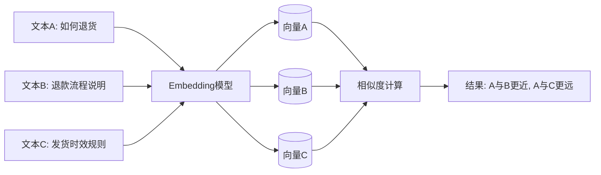
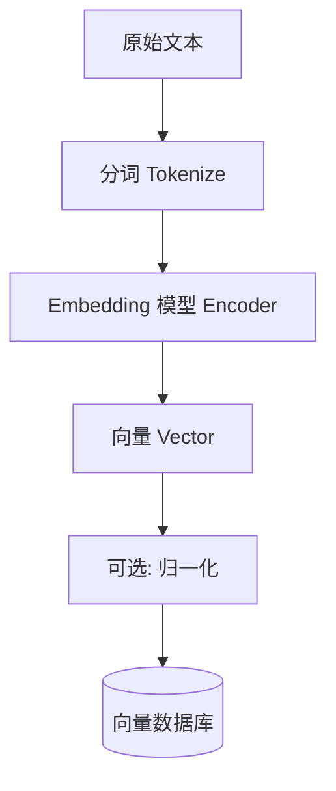
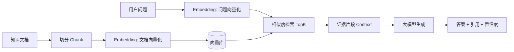
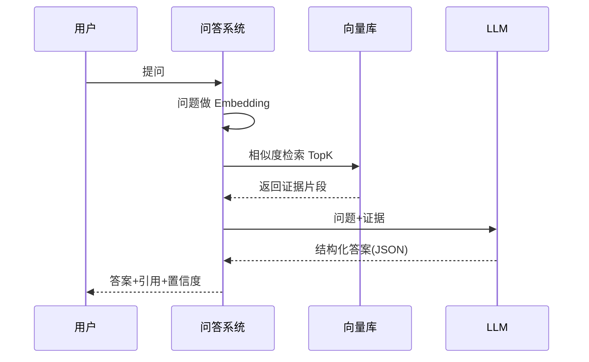

# Embedding 从零到一：给零基础学习者的技术分享文档

> 适用场景：技术分享、内部培训、学习笔记
> 目标：让听众真正理解 Embedding 是什么、为什么有用、在 RAG 里做什么
> 版本：v1.0（后续可持续细化）

---

## 1. 先说结论：Embedding 到底是什么

**Embedding 是“把文本（或图片、音频）变成一串数字向量”的方法。**

这串数字的关键价值不是“长得好看”，而是：

1. 语义相近的内容，在向量空间里更近。
2. 语义不相关的内容，在向量空间里更远。

你可以把 Embedding 理解成：

- 给每段文本分配一个“语义坐标”。
- 后续我们通过“坐标距离”做检索、推荐、聚类、去重。

---

## 2. 为什么需要 Embedding（不用它会怎样）

### 2.1 传统关键词匹配的痛点

例子：

- 用户问：`如何退货？`
- 文档写的是：`退款流程`

关键词系统可能匹配不到，因为“退货”和“退款”不完全一样。

### 2.2 Embedding 解决了什么

Embedding 不只看字面是否相同，更看**语义是否接近**。

- `如何退货` 和 `退款流程` 可能被映射到相近位置。
- 即使没有完全相同关键词，也能检索到相关内容。

### 2.3 对比表（可直接放到 PPT）

| 方案 | 看重什么 | 优点 | 缺点 |
|---|---|---|---|
| 关键词检索 | 字面词是否一致 | 快、便宜、可解释 | 同义词/改写容易漏召回 |
| Embedding 检索 | 语义是否接近 | 能召回同义改写内容 | 需要向量模型和向量库 |
| Hybrid（关键词+向量） | 二者结合 | 实战效果通常最好 | 系统复杂度更高 |

---

## 3. 直观类比：把文本放进“语义地图”

可以想象有一张地图：

- “退款、退货、售后”在同一片区域。
- “物流、发货、签收”在另一片区域。
- “招聘、面试、薪资”在更远区域。

文本经过 Embedding 后，就像在地图上有了坐标。

### 图表 1：语义地图类比



---

## 4. Embedding 的工作流程（从输入到向量）

### 4.1 文字版流程

1. 输入文本（例如一句话或一个段落）。
2. 文本分词/切 token。
3. 送入编码模型（Embedding Model）。
4. 输出固定维度向量（如 768/1024/1536 维）。
5. 把向量存入向量库，供后续检索。

### 图表 2：Embedding 生产流程



---

## 5. “近”到底怎么计算：相似度

最常用是余弦相似度（Cosine Similarity）：

`cos(a,b) = (a·b) / (||a|| * ||b||)`

零基础理解：

- 把每个向量看作一根“箭头”。
- 方向越一致，余弦值越接近 1。
- 越不一致，值越低，甚至接近 0 或负数。

### 相似度结果可这样解读（经验，不是绝对）

| 余弦相似度 | 解释 |
|---|---|
| 0.85 ~ 1.00 | 高相关，通常可直接作为强证据 |
| 0.70 ~ 0.85 | 中相关，需要结合更多上下文判断 |
| < 0.70 | 弱相关，谨慎使用或触发拒答/转人工 |

> 注意：阈值与模型、领域、文本长度有关，要通过评测集标定。

---

## 6. Embedding 在 RAG 里的位置（核心图）

RAG = Retrieval + Generation。

- Retrieval（检索）阶段的核心就是 Embedding。
- Generation（生成）阶段再由 LLM 组织答案。

### 图表 3：RAG 中 Embedding 的位置



一句话总结：

- **Embedding 决定“找不找得到”**。
- **LLM 决定“讲不讲得好”**。

---

## 7. 初学者最容易混淆的 4 件事

### 7.1 Embedding 模型 vs 大语言模型

- Embedding 模型：擅长“编码语义”，输出向量。
- 大语言模型：擅长“生成文字”，输出自然语言。

### 7.2 向量维度越高越好吗

不一定。

- 高维可能表达更细，但成本更高。
- 实战要看：效果、速度、成本三者平衡。

### 7.3 只换更大模型能提高 RAG 吗

通常先优化这些更有效：

1. chunk 切分策略。
2. metadata 质量。
3. 检索参数（topK、阈值、重排）。

### 7.4 有 Embedding 就不会幻觉吗

不会。

- Embedding 只能提高“找证据”的概率。
- 还需在生成阶段加约束：必须引用、低置信度拒答。

---

## 8. 用一个完整例子讲透（可口播）

### 场景

你在做企业知识库机器人。

文档里有三段：

1. `refund_sop.md`：签收后 7 天内可申请退款。
2. `shipping_sop.md`：工作日 24 小时内发货。
3. `faq.md`：支持发票开具。

### 用户问题

`我签收 10 天了还能退款吗？`

### 系统过程

1. 问题先做 Embedding。
2. 在向量库检索最相近 chunks。
3. 命中 `refund_sop.md` 相关段落。
4. LLM 基于证据回答：超过 7 天通常不支持。
5. 返回引用：`refund_sop.md#2` 的原文片段。

### 预期输出（示例）

```json
{
  "answer": "根据退款规则，签收超过7天通常不支持退款。建议联系人工客服确认特殊情况。",
  "citations": [
    {
      "source_file": "refund_sop.md",
      "chunk_id": "refund_sop.md#2",
      "quote": "用户签收后7个自然日内可申请退款，超时默认不受理。"
    }
  ],
  "confidence": "high",
  "need_handoff": false,
  "handoff_reason": ""
}
```

---

## 9. 进阶一点点：影响效果的关键参数

| 参数 | 典型范围 | 作用 | 常见坑 |
|---|---|---|---|
| chunk_size | 300~800（中文字符） | 控制每块信息密度 | 太大噪声高，太小上下文断裂 |
| chunk_overlap | 50~150 | 保持上下文连续 | 过大导致冗余和成本上升 |
| topK | 3~8 | 取回多少候选证据 | 过小漏信息，过大引入噪声 |
| 相似度阈值 | 按评测定 | 控制拒答/转人工 | 盲目套阈值导致误判 |

建议顺序：

1. 先调 chunk。
2. 再调 topK 和阈值。
3. 最后考虑换模型。

---

## 10. 图表：从问题到答案的时序



---

## 11. 做技术分享时可以直接用的讲法

### 11.1 30 分钟版本（建议）

1. 5 分钟：问题背景（为什么关键词检索不够）。
2. 8 分钟：Embedding 原理（语义坐标、相似度）。
3. 8 分钟：Embedding 在 RAG 中的位置。
4. 5 分钟：案例演示（命中+拒答）。
5. 4 分钟：常见误区与优化路线。

### 11.2 一句话金句（适合收尾）

- Embedding 不是让模型“更会说”，而是让系统“更会找”。
- RAG 的上限，往往先由检索决定，再由生成决定。

---

## 12. 常见问答（分享现场高频）

### Q1：Embedding 是不是只能处理文本？

不是。图片、音频、代码也可以做 Embedding，只是模型不同。

### Q2：Embedding 一定比关键词好吗？

不绝对。结构化字段检索、精确术语匹配时，关键词很强。实战常用 Hybrid。

### Q3：为什么同一句话每次向量都一样？

在同模型、同预处理条件下通常稳定一致，这正是可检索的基础。

### Q4：能不能只做 Embedding，不用 LLM？

可以。你能做“语义搜索/相似推荐”；但要自然语言回答，通常还需要 LLM。

---

## 13. 分享后可落地的练习任务（给学习者）

1. 用 3 份文档做一个最小 RAG 问答。
2. 打印每次问题命中的 `topK` 证据与相似度。
3. 做 20 条评测题：10 条命中、5 条模糊、5 条库外。
4. 基于结果调整 chunk 和阈值，记录前后指标变化。

---

## 14. 复盘模板（持续细化这个文档时使用）

```text
版本：vX.Y
日期：YYYY-MM-DD
本次新增：
- 新增图表：
- 新增案例：
- 修改阈值建议：

基于实践得到的新结论：
- ...

下一步计划：
- ...
```

---

## 15. 最后总结

对零基础学习者来说，先抓住这三点就够了：

1. Embedding = 把文本变成语义向量。
2. 语义检索靠“向量距离”，不是只靠关键词。
3. 在 RAG 中，Embedding 负责“找证据”，LLM 负责“组织答案”。

只要你能把这三句话讲清楚，再用一个退款/物流案例讲一遍，听众基本就能真正理解 Embedding。
