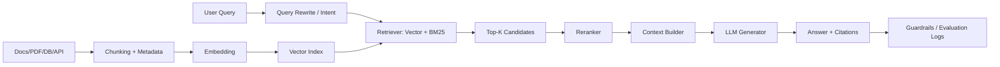

# RAG 技术分享文档（从零到生产级）

## 学习过程记录（原始问题）

- 问题1：RAG是什么，详细的底层原理
- 问题2：RAG如何工作
- 问题3：有RAG和无RAG的差异
- 问题4：RAG如何实现，详细的解决方案

> 适用场景：你需要做一次“深入技术分享”，听众包含算法工程师、后端工程师、AI 应用开发者或技术管理者。  
> 文档目标：围绕你提出的 4 个问题，系统讲清楚 RAG 的定义、演进、底层原理、工程实现与落地方法。本文已融合 AWS 官方“什么是 RAG”页面的核心观点。

---

## 0. 先用一句话讲清 RAG

**RAG（Retrieval-Augmented Generation，检索增强生成）** 是一种把“外部知识检索”与“大模型生成”结合起来的架构：  
先从权威知识库检索证据，再让 LLM 基于证据生成答案，从而提升**准确性、时效性、可追溯性与可控性**。

---

## 1. 问题 1：RAG 是什么？底层原理是什么？

## 1.1 定义：参数化记忆 + 非参数化记忆

- **参数化记忆（Parametric Memory）**：模型权重里“记住”的知识（训练阶段写入）。
- **非参数化记忆（Non-parametric Memory）**：外部知识库（文档库、数据库、搜索引擎、向量库等）。

RAG 的核心思想：
- 不要求模型把所有知识都“背下来”；
- 回答时优先“查证据”，再“生成答案”。

这把问答范式从：
- `仅靠模型记忆回答`  
变成：
- `检索证据 -> 条件生成回答`。

## 1.2 融合 AWS 官方定义（用于分享时增强权威性）

结合 AWS 页面可归纳为三点：

- RAG 的目标是让 LLM 在生成前引用训练数据之外的权威来源。
- RAG 让模型能使用组织内部知识，而不必重新训练基础模型。
- RAG 是一种更经济的增强方式，重点收益是相关性、准确性与实用性提升。

## 1.3 数学视角（直观版）

给定问题 `x`、答案 `y`、候选文档 `d`：

- 检索器估计 `p(d|x)`（文档与问题相关度）。
- 生成器估计 `p(y|x,d)`（给定文档时的答案概率）。
- 最终可以理解为加权组合：`p(y|x) ≈ Σ p(y|x,d) * p(d|x)`。

所以 RAG 质量取决于两件事：
- 是否**找对文档**（Retrieval）
- 是否**用好文档**（Generation）

## 1.4 底层原理拆解

### A. 文本向量化（Embedding）

- 把文本映射到高维向量空间：`f(text) -> R^d`。
- 相似语义文本在向量空间更接近。
- 常见相似度：余弦相似度 `cos(q, d)`、点积等。

### B. 近似最近邻检索（ANN）

海量向量下，暴力检索成本高，通常使用 ANN：
- **HNSW**：图结构索引，召回/延迟平衡好。
- **IVF/IVF-PQ**：聚类 + 量化，节省内存，适合超大规模。

### C. 稀疏检索与密集检索

- 稀疏检索：BM25（关键词匹配），术语精确命中强。
- 密集检索：Embedding（语义匹配），同义表达更强。
- 生产常用：**Hybrid Retrieval（混合检索）**。

### D. 重排（Rerank）

Top-K 粗召回后，使用 cross-encoder 对 `(query, doc)` 精排，提升前几条证据质量。

### E. 条件生成与注意力约束

- LLM 在上下文窗口内对证据做注意力计算，再生成答案。
- 上下文窗口有限，证据拼接策略（顺序/截断/压缩）直接影响质量。
- 典型问题：**Lost in the Middle（中间信息被忽略）**。

### F. 幻觉抑制机制

RAG 不是消灭幻觉，而是通过“证据约束”降低幻觉概率：
- 证据不足时拒答；
- 强制引用出处；
- 生成后做 grounding/verifier 二次校验。

## 1.5 为什么 RAG 重要（融合 AWS 的纯 LLM 风险）

AWS 页面强调了纯 LLM 的典型问题，这些也是 RAG 的直接价值来源：

- 没有答案时，LLM 也可能输出自信但错误的内容。
- 训练数据静态，面对新近信息时容易过时。
- 可能依据非权威来源组织回答，降低可信度。
- 多义词与领域术语冲突会放大错误。

## 1.6 RAG 的本质价值

- 把知识更新成本从“重训模型”降为“更新知识库”。
- 让答案可回溯到证据源，支持审计与合规。
- 在垂直领域（医疗、金融、法务、企业知识）显著提升可用性。
- 让开发者可控数据源、可控权限、可控输出行为。

---

## 2. 问题 2：RAG 如何工作？

## 2.1 全链路流程（离线 + 在线）

### 离线索引阶段（Indexing Pipeline）

1. 数据接入：PDF、网页、Wiki、数据库、工单、代码库等。  
2. 文本清洗：去噪、去模板、去重复、结构化（标题/段落/表格）。  
3. 切分 Chunk：按语义或层级切分，保留 metadata。  
4. 向量化：为 chunk 生成 embedding。  
5. 建索引：写入向量库；必要时同步关键词倒排索引。  
6. 版本管理：增量更新、失效回收、权限标签（ACL）。

### 在线查询阶段（Retrieval + Generation）

1. Query 预处理：改写、扩展、意图识别。  
2. 召回：向量检索 / BM25 / 混合召回，得到 Top-K。  
3. 重排：reranker 提升证据排序质量。  
4. 上下文构造：去重、压缩、引用编号、按策略拼接。  
5. 生成：LLM 在“受约束提示词”下回答。  
6. 后处理：事实核验、引用校验、格式化输出。  
7. 观测：记录命中率、回答质量、延迟与成本。

## 2.2 与 AWS 四步工作流的对照（你可直接口播）

AWS 页面把 RAG 拆为 4 个清晰步骤，与工程实践一一对应：

1. **创建外部数据**：把 API/DB/文档仓的数据向量化并入库。  
2. **检索相关信息**：把用户问题向量化并做相似度匹配。  
3. **增强提示词**：把检索证据注入 prompt 作为上下文约束。  
4. **更新外部数据**：异步更新文档和嵌入（流式或批处理）。

关键结论：**RAG 不是一次性建库，而是持续更新的知识系统**。

## 2.3 一张流程图（分享时可直接用）



## 2.4 关键参数如何影响效果

- `chunk_size` 太小：语义断裂，检索到碎片。  
- `chunk_size` 太大：噪音高，关键信息被淹没。  
- `top_k` 太小：召回不足；太大：上下文污染、成本上升。  
- rerank 关闭：延迟低但前列证据质量可能不足。  
- prompt 约束弱：易幻觉；约束过强：可能答非所问。

---

## 2.5 基于知乎实战文章的流程细化（离线阶段）

结合你给的知乎文章，离线阶段建议再补 3 个关键动作：

1. **数据提取标准化**：多格式数据（PDF/Word/网页/表格/OCR）先统一到同一文本范式。  
2. **元数据提取**：为每个 chunk 增加 `title/file/time/source/acl`，后续用于过滤和追溯。  
3. **分块双策略**：
   - 句子粒度分块：语义更完整，精细召回更准；
   - 固定长度分块：工程实现简单，但要配合 overlap 减少语义断裂。

这组方法的本质是：**先把“可检索质量”做好，再谈生成质量**。

## 3. 问题 3：有 RAG 和无 RAG 的差异

| 维度 | 无 RAG（纯 LLM） | 有 RAG |
|---|---|---|
| 知识来源 | 训练语料中的历史记忆 | 实时/近实时外部知识 |
| 时效性 | 差（知识可能过期） | 强（知识库更新即可生效） |
| 可追溯性 | 弱（来源不透明） | 强（可返回引用证据） |
| 幻觉风险 | 较高 | 通常更低（依赖检索质量） |
| 垂直领域适配 | 需微调或继续训练 | 更新语料即可适配 |
| 开发者控制权 | 弱 | 强（来源可控、权限可控、策略可调） |
| 成本结构 | 训练成本高，推理可控 | 检索 + 推理双成本 |
| 延迟 | 可能更低 | 通常更高（多一步检索/重排） |
| 合规性 | 难审计 | 可审计、可做权限隔离 |
| 用户信任建立 | 较难 | 更容易（可查来源） |

### 结论

- 通用闲聊、创意写作场景，纯 LLM 往往够用。  
- 企业知识问答、政策解读、客服支持、代码知识库等，RAG 通常是必选。

---

## 4. 问题 4：RAG 如何实现？详细解决方案

## 4.1 从零到一实施路径（推荐）

### 阶段 A：MVP（2~4 周）

1. 明确边界：例如“仅回答内部产品手册”。  
2. 收集语料：先挑 100~1000 份高质量文档。  
3. 跑通最小链路：`Chunk -> Embedding -> VectorDB -> TopK -> LLM`。  
4. 输出引用：每条回答必须带证据。  
5. 人工评测：先评 50~100 条真实问题。

### 阶段 B：效果提升（4~8 周）

1. 上 Hybrid Retrieval（BM25 + 向量）。  
2. 增加 reranker。  
3. 做 query rewrite（同义词、缩写、错别字）。  
4. 优化 chunk（标题层级 + overlap）。  
5. 建立离线评测集（问题、标准答案、标准证据）。

### 阶段 C：生产化（8 周+）

1. 增量索引 + 数据版本管理。  
2. ACL 权限过滤（检索前过滤，不是回答后过滤）。  
3. 缓存策略（query/embedding/答案缓存）。  
4. 监控告警（召回率、拒答率、延迟、token 成本）。  
5. A/B 测试和回滚机制。

## 4.2 生产级架构（逻辑组件）

- **Ingestion Service**：抓取、解析、清洗、去重。  
- **Index Service**：切分、向量化、索引构建。  
- **Retrieval Service**：混合召回 + 重排。  
- **Orchestrator**：上下文编排、Prompt 模板、工具调用。  
- **LLM Gateway**：模型路由、限流、重试、成本统计。  
- **Guardrails**：安全策略、敏感信息过滤、事实校验。  
- **Eval Platform**：离线评测 + 在线反馈闭环。

## 4.3 关键工程策略

### 1) Chunk 设计

- 从 300~800 tokens 起步（按文档类型调参）。
- overlap 建议 10%~20%，降低语义断裂。
- metadata 至少包含 `title/source/time/acl/version`。

### 2) 检索策略

- 第一层：召回广（dense + sparse）。
- 第二层：重排准（cross-encoder）。
- 第三层：上下文压缩（只保留回答所需句段）。

### 3) Prompt 约束

- 明确“只能基于证据回答”。
- 证据不足时必须输出“不确定/未找到”。
- 强制给出引用编号，便于审计与前端展示。

### 4) 权限与合规

- 检索阶段执行 ACL，避免越权内容进入上下文。
- 日志做脱敏与最小化存储。

## 4.4 RAG 与语义搜索关系（融合 AWS 观点）

- 语义搜索不是 RAG 的替代，而是关键增强器。  
- 在知识密集型任务中，仅关键词检索通常不够。  
- 推荐组合：`语义检索 + 关键词检索 + 重排`。  
- 目标是把更高质量的证据段落送给 LLM，提升最终答案质量。

## 4.5 评测体系（必须建立）

### 检索层指标

- `Recall@K`：正确证据是否在 Top-K。  
- `MRR`：首个正确证据排名质量。  
- `nDCG`：整体排序质量。

### 生成层指标

- `Faithfulness`：答案是否忠于证据。  
- `Answer Relevance`：答案是否真正回答问题。  
- `Citation Precision`：引用是否准确指向证据。

### 系统层指标

- `P95 Latency`：95 分位响应时延。  
- `Token Cost / Query`：单问成本。  
- `Deflection Rate`：自动解决率（客服场景）。

## 4.6 常见问题与修复手册

1. **检索不到**：先查 chunk 与 query rewrite，再调 top_k。  
2. **检索到但答错**：加 rerank，检查 prompt 是否强制引用。  
3. **引用不准**：上下文绑定 chunk_id，生成后做 citation 校验。  
4. **回答慢**：降低 top_k、做缓存、替换轻量 reranker。  
5. **成本高**：上下文压缩、分级模型路由（小模型优先）。

## 4.7 AWS 云上实现映射（可直接用于“方案选型”一页）

- **Amazon Bedrock Knowledge Bases**：托管式 RAG 路径，简化向量化、检索和增强生成流程。  
- **Amazon Kendra**：企业级检索与语义排序，可作为高精度检索层，并支持权限过滤。  
- **Amazon SageMaker JumpStart**：用于更高定制度的模型与方案实验。

---

## 4.8 融合知乎文章的高级 RAG 方法（实践优先）

你给的知乎文章重点在“Advanced RAG 的可落地技巧”，可直接纳入本方案：

### 1) RAG Fusion（多查询检索融合）

- 先让 LLM 基于用户问题生成多个子查询（覆盖不同表达和角度）。
- 每个子查询独立检索，再合并候选结果。
- 融合排序可采用 **RRF（Reciprocal Rank Fusion）**。

适用场景：企业内存在大量近义词、缩写、内部黑话时，单查询召回不稳定。

### 2) 分层索引（Hierarchical Index）

- 先建“摘要索引”，再建“细粒度 chunk 索引”。
- 查询时先用摘要索引筛文档，再在候选文档内做细粒度检索。

价值：在大语料规模下显著降低检索范围，改善延迟与噪音。

### 3) 假设性问题与 HyDE

- **Hypothetical Questions**：为文档块生成可能被问的问题并向量化，用“问题-问题”相似性检索。  
- **HyDE**：先让 LLM 根据查询生成“假设答案”，再拿该假设答案向量参与检索。

价值：缩小“用户问法”与“文档写法”之间的语义鸿沟。

### 4) 内容增强检索（Sentence Window / Parent-Child）

- **Sentence Window**：按句子级别召回，随后向两侧扩窗补上下文。  
- **Parent-Child Retrieval**：先匹配子块，再回溯更大的父块用于生成。

价值：兼顾“检索精准度”和“生成上下文完整性”。

### 5) 重排与过滤（Post-Retrieval）

- 在召回后加入 reranker（cross-encoder / LLM rerank）提升前列质量。  
- 配合相似度阈值、关键词、元数据、时间范围做过滤。

价值：这是进入 LLM 前的最后质量闸门，通常最具性价比。

### 6) 查询路由与对话压缩

- 根据问题类型路由到不同索引或检索策略（FAQ 索引、政策索引、代码索引）。  
- 多轮会话中先做问题压缩/改写，再检索，避免上下文漂移。

价值：多知识域、多轮问答场景中稳定性更高。

### 7) 响应合成（Response Synthesis）

- 不只“把所有上下文拼进一次 prompt”。
- 更稳健做法：分块回答 -> 汇总，或先压缩证据 -> 再生成。

价值：在长文档和高噪音场景下更不易丢关键信息。

### 8) 代价与权衡（知乎文强调）

- 融合检索、重排、路由会提升效果，但也会增加延迟和成本。  
- 某些优化只对部分问题有效，可能伤害另一类问题。  
- 因此必须建立评测闭环：**先基线，再逐项 A/B 测试**。

## 5. RAG 是如何进化来的？（技术演进脉络）

## 5.1 前史：传统 IR + QA

- 搜索长期使用倒排索引、TF-IDF、BM25。  
- 问答系统先检索文档，再抽取答案。  
- 核心思想已是“检索与回答解耦”。

## 5.2 神经检索阶段

- Dense Retrieval（如 DPR）提升语义匹配能力。  
- 缓解关键词不重合导致的召回缺陷。

## 5.3 RAG 范式确立

- 检索系统与生成模型融合，形成“检索增强生成”标准架构。
- 从“模型记忆一切”转向“模型 + 外部知识”。

## 5.4 LLM 时代工程化爆发

- 向量数据库、编排框架、评测框架成熟。  
- 企业可在不重训大模型的情况下快速构建领域助手。

## 5.5 当前与下一步趋势

- **Hybrid RAG**：稀疏 + 密集 + 结构化检索融合。  
- **Agentic RAG**：模型自主规划多跳检索与工具调用。  
- **GraphRAG**：图结构增强多跳推理。  
- **Multimodal RAG**：图文表音视频混合检索。  
- **Self-RAG / Corrective RAG**：生成中自检与纠错。

---

## 6. 长上下文模型出现后，RAG 还需要吗？

结论：**需要，且通常是互补关系。**

- 长上下文擅长“单次喂入更多内容”；
- RAG 擅长“从海量知识中先筛选高相关证据再回答”。

在企业环境里，知识体量通常远超上下文窗口，且要求权限控制、可追溯、可更新，因此 RAG 依然是核心架构。

---

## 7. 分享可直接使用的落地案例模板

> 场景：企业内部知识助手（制度、产品文档、FAQ）

### 目标

- 回答准确率 > 85%
- 证据可追溯率 100%
- P95 延迟 < 3 秒（文本场景）

### 方案

- 数据：Confluence + PDF + 工单知识库。  
- 检索：BM25 + 向量混合召回，Top50 -> rerank Top8。  
- 生成：严格引用模式，不足证据时拒答。  
- 评测：每周离线评测 + 在线反馈闭环。

### 结果（示例口径）

- Recall@10 从 0.62 提升到 0.81。  
- 回答有效率从 54% 提升到 82%。  
- 人工客服转人工率下降约 30%。

---

## 8. 你做分享时可直接用的讲稿提纲（60~90 分钟）

1. 为什么需要 RAG（纯 LLM 的边界）  
2. RAG 的定义与核心思想（参数化 + 非参数化记忆）  
3. 底层原理（Embedding、ANN、Hybrid、Rerank、Grounding）  
4. 全链路架构（离线索引 + 在线问答）  
5. 有无 RAG 的效果与成本差异  
6. 从 MVP 到生产化实施路径  
7. 评测体系与常见坑  
8. 演进趋势（Agentic/Graph/Multimodal/Self-RAG）  
9. Q&A

---

## 9. 最后的关键结论（可作为结束页）

1. **RAG 不是一个模型，而是一套系统工程方法。**  
2. **RAG 的上限取决于检索质量，下限取决于生成约束。**  
3. **先建立评测体系，再做优化迭代。**  
4. **企业落地要把权限、审计、更新、成本、延迟与效果同等看待。**

---

## 附：极简伪代码（帮助听众建立工程直觉）

```python
def rag_answer(query: str):
    # 1) query 改写
    q = rewrite_query(query)

    # 2) 混合召回
    dense_hits = vector_search(q, top_k=40)
    sparse_hits = bm25_search(q, top_k=40)
    candidates = merge_and_dedup(dense_hits, sparse_hits)

    # 3) 重排取精
    top_docs = rerank(q, candidates, top_k=8)

    # 4) 构造上下文
    context = build_context(top_docs, max_tokens=3500)

    # 5) 受约束生成
    answer = llm_generate(
        system="仅基于证据回答，不确定时明确说明，并给出引用编号",
        user=f"问题: {query}\n证据:\n{context}"
    )

    # 6) 引用校验
    checked = verify_citations(answer, top_docs)
    return checked
```

---

## 参考资料

- AWS：什么是检索增强生成（RAG）  
  https://aws.amazon.com/cn/what-is/retrieval-augmented-generation/
- 知乎：一文读懂：大模型RAG（检索增强生成）含高级方法  
  https://www.zhihu.com/tardis/zm/art/675509396?source_id=1003

学习问题记录(不要删除)

1.RAG先检索答案,那模型在其中起什么作用,只是RAG输出标准答案不就可以吗

2.RAG也是向量化,计算相关性,和大模型一样,如果RAG成本也很高的话,那不如直接本地部署训练大模型


## 学习问题解答（新增）

### 问题1
RAG先检索答案，那模型在其中起什么作用？只是RAG输出标准答案不就可以吗？

不是。RAG里的“检索”负责找证据，“模型”负责把证据变成可用答案，两者职责不同：

1. 模型要理解用户真实意图：同一句话可能有不同业务语义，检索本身只做相似匹配。  
2. 模型要跨片段综合：真实问题常需要把多个 chunk 里的信息拼起来推理。  
3. 模型要处理冲突与不完整：证据可能互相矛盾或缺失，需要模型做不确定性表达（如拒答/补充说明）。  
4. 模型要完成“生成任务”：总结、对比、改写、结构化输出（表格/步骤）不是检索系统本身能直接完成的。  

什么时候“只检索不生成”也可行？
- FAQ、固定问答、模板化场景可以直接返回检索片段或标准答案。
- 但一旦进入复杂问答、跨文档推理、可读性要求高的场景，就必须要模型参与。

### 问题2
RAG也是向量化、算相关性，成本高的话，为何不直接本地训练大模型？

两者成本结构完全不同：

1. 本地训练/微调大模型的成本是“前置重投入”：GPU、数据清洗、训练迭代、评测、运维都很重。  
2. RAG的成本是“按调用付费+持续维护知识库”：主要在检索、重排、推理 token。  
3. 知识更新成本上，RAG通常更低：更新文档并重建索引即可；训练模型则需要再训练流程。  
4. 可追溯和合规上，RAG通常更有优势：可引用来源、做权限过滤；纯训练模型很难审计“答案从哪来”。  

真正的工程选择不是二选一，而是按场景：
- 知识变化快、要求可追溯：优先 RAG。  
- 任务封闭、知识稳定、延迟极端敏感：可考虑小模型本地化（含微调）。  
- 最常见方案：**本地/私有小模型 + RAG**，同时兼顾成本、控制和效果。

### 这两问的分享版结论

- RAG不是“检索替代模型”，而是“检索增强模型”。
- 训练模型解决“能力上限”，RAG解决“知识时效与可控性”。
- 企业落地里，混合架构通常比单一路线更实用。
