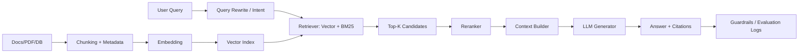

# RAG 技术分享文档（从零到生产级）

> 适用场景：你需要做一次“深入技术分享”，听众包含算法工程师、后端工程师、AI 应用开发者或技术管理者。  
> 文档目标：围绕你提出的 4 个问题，系统讲清楚 RAG 的定义、演进、底层原理、工程实现与落地方法。

---

## 0. 先用一句话讲清 RAG

**RAG（Retrieval-Augmented Generation，检索增强生成）** 是一种把“外部知识检索”与“大模型生成”结合起来的架构：  
先从知识库里找到最相关的证据，再让模型基于证据生成答案，从而提升**准确性、时效性、可追溯性**。

---

## 1. 问题 1：RAG 是什么？底层原理是什么？

## 1.1 定义：参数化记忆 + 非参数化记忆

- **参数化记忆（Parametric Memory）**：模型权重里“记住”的知识（训练时写入）。
- **非参数化记忆（Non-parametric Memory）**：外部知识库（文档库、数据库、搜索引擎、向量库等）。

RAG 的核心思想：
- 不要求模型把所有知识都“背下来”；
- 需要回答时，先查外部知识，再组织答案。

这本质上是把 QA 问题从：
- `仅靠模型记忆回答`  
变成：
- `检索证据 -> 条件生成回答`。

## 1.2 数学视角（直观版）

给定问题 `x`，答案 `y`，候选文档 `d`：

- 检索器给出 `p(d|x)`（文档与问题相关概率）；
- 生成器给出 `p(y|x,d)`（给定问题和文档时生成答案概率）；
- 最终可理解为对多个文档加权：`p(y|x) ≈ Σ p(y|x,d) * p(d|x)`。

这说明 RAG 的质量取决于两件事：
- 是否**找对文档**（Retrieval）
- 是否**用好文档**（Generation）

## 1.3 底层原理拆解

### A. 文本向量化（Embedding）

- 把文本映射到高维向量空间：`f(text) -> R^d`。
- 相似语义的文本在向量空间更接近。
- 常见相似度：余弦相似度 `cos(q, d)`、点积等。

### B. 近似最近邻检索（ANN）

海量向量下，暴力检索太慢，通常用 ANN 索引：
- **HNSW**：图结构索引，召回和延迟平衡好，工业里非常常见。
- **IVF/IVF-PQ**：聚类 + 量化，节省内存，适合超大规模。

### C. 稀疏检索与密集检索

- 稀疏检索：BM25（关键词匹配），对术语精确命中好。
- 密集检索：Embedding（语义匹配），对同义表达更强。
- 实战常用：**Hybrid Retrieval（混合检索）**，二者结合。

### D. 重排（Rerank）

Top-K 粗召回后，使用 cross-encoder 对 `(query, doc)` 精排，提升前几条证据质量。

### E. 条件生成与注意力约束

- LLM 在上下文窗口中对证据做注意力计算，再生成答案。
- 上下文窗口有限，证据拼接策略（顺序、截断、压缩）直接影响回答质量。
- 常见问题：**Lost in the Middle（中间信息被忽略）**。

### F. 幻觉抑制机制

RAG 不是消灭幻觉，而是通过“提供证据”降低幻觉概率：
- 证据不足时拒答；
- 要求引用出处；
- 事实校验（answer grounding / verifier）二次过滤。

## 1.4 RAG 的本质价值

- 把知识更新成本从“重训模型”降为“更新知识库”。
- 让答案可回溯到原文证据，支持审计与合规。
- 在垂直领域（医疗、金融、法务、企业知识）显著提升可用性。

---

## 2. 问题 2：RAG 如何工作？

## 2.1 全链路流程（离线 + 在线）

### 离线索引阶段（Indexing Pipeline）

1. 数据接入：PDF、网页、Wiki、数据库、工单、代码库等。  
2. 文本清洗：去噪、去模板、去重复、结构化（标题/段落/表格）。  
3. 切分 Chunk：按语义或层级切分，保留 metadata。  
4. 向量化：为 chunk 生成 embedding。  
5. 建索引：写入向量库；必要时同步关键词倒排索引。  
6. 版本管理：增量更新、失效回收、权限标签（ACL）。

### 在线查询阶段（Retrieval + Generation）

1. Query 预处理：改写、扩展、意图识别、过滤敏感词。  
2. 召回：向量检索 / BM25 / 混合召回，拿到 Top-K。  
3. 重排：reranker 提升证据排序。  
4. 上下文构造：去重、压缩、引用编号、按策略拼接。  
5. 生成：LLM 在“受约束提示词”下回答。  
6. 后处理：事实核验、引用校验、格式化输出。  
7. 观测：记录检索命中率、回答质量、延迟和成本。

## 2.2 一张流程图（分享时可直接用）



## 2.3 关键参数如何影响效果

- `chunk_size` 太小：语义断裂，检索到碎片。  
- `chunk_size` 太大：噪音高，相关信息被淹没。  
- `top_k` 太小：召回不足；太大：上下文污染、成本上升。  
- rerank 开关：通常提升准确率，但增加延迟。  
- prompt 约束强度：太弱易幻觉，太强可能“答非所问”。

---

## 3. 问题 3：有 RAG 和无 RAG 的差异

| 维度 | 无 RAG（纯 LLM） | 有 RAG |
|---|---|---|
| 知识来源 | 训练语料中的历史记忆 | 实时/近实时外部知识 |
| 时效性 | 差（知识可能过期） | 强（知识库更新即生效） |
| 可追溯性 | 弱（很难给出处） | 强（可给文档引用） |
| 幻觉风险 | 较高 | 通常更低（取决于检索质量） |
| 垂直领域适配 | 需微调或继续训练 | 更新语料即可适配 |
| 成本结构 | 训练成本高，推理可控 | 检索 + 推理双成本 |
| 延迟 | 可能更低 | 通常更高（多一步检索/重排） |
| 合规性 | 难审计 | 可审计、可做权限隔离 |

### 结论

- 如果是通用闲聊、创意写作，纯 LLM 往往够用。  
- 如果是企业知识问答、政策解读、客服支持、代码知识库，RAG 通常是必选。

---

## 4. 问题 4：RAG 如何实现？详细解决方案

## 4.1 从零到一的实施路径（推荐）

### 阶段 A：MVP（2~4 周）

1. 明确场景：定义问题边界（例如“仅回答内部产品手册”）。  
2. 收集语料：挑 100~1000 份高质量文档先跑通。  
3. 建立最小链路：`Chunk -> Embedding -> VectorDB -> TopK -> LLM`。  
4. 输出引用：每条回答必须附证据片段。  
5. 人工评测：先看 50~100 条真实问题的可用率。

### 阶段 B：效果提升（4~8 周）

1. 引入 Hybrid Retrieval（BM25 + 向量）。  
2. 加 reranker。  
3. 做 query rewrite（同义词、缩写、错别字）。  
4. 优化 chunk 策略（按标题层级 + 滑窗 overlap）。  
5. 建立离线评测集（黄金问答 + 标准证据）。

### 阶段 C：生产化（8 周+）

1. 增量索引 + 数据版本管理。  
2. 权限控制（按用户/部门过滤可检索文档）。  
3. 缓存策略（query 缓存、embedding 缓存、答案缓存）。  
4. 监控告警（召回率、拒答率、延迟、token 成本）。  
5. A/B 测试与回滚机制。

## 4.2 生产级架构（逻辑组件）

- **Ingestion Service**：数据抓取、解析、清洗、去重。  
- **Index Service**：切分、向量化、索引构建。  
- **Retrieval Service**：混合召回 + 重排。  
- **Orchestrator**：上下文编排、Prompt 模板、工具调用。  
- **LLM Gateway**：模型路由、限流、重试、成本统计。  
- **Guardrails**：安全策略、敏感信息过滤、事实校验。  
- **Eval Platform**：离线评测 + 在线反馈闭环。

## 4.3 关键工程策略

### 1) Chunk 设计

- 推荐从 300~800 tokens 起步（按文档类型调参）。
- overlap 一般 10%~20%，减少切分断层。
- 为每个 chunk 保留 `title/source/time/acl/version` metadata。

### 2) 检索策略

- 第一层：召回广（dense + sparse）。
- 第二层：重排准（cross-encoder）。
- 第三层：上下文压缩（只保留回答所需句段）。

### 3) Prompt 约束

- 明确“只能根据给定证据回答”。
- 证据不足时必须说“不确定/未找到”。
- 强制输出引用编号，便于审计与前端展示。

### 4) 权限与合规

- 检索前按 ACL 过滤候选文档，而不是回答后再过滤。
- 对日志做脱敏与最小化存储。

## 4.4 评测体系（必须建立）

### 检索层指标

- `Recall@K`：正确证据是否在 Top-K 里。  
- `MRR`：首个正确证据排名质量。  
- `nDCG`：整体排序质量。

### 生成层指标

- `Faithfulness`：答案是否忠于证据。  
- `Answer Relevance`：答案是否真正回答问题。  
- `Citation Precision`：引用是否准确指向支持证据。

### 系统层指标

- `P95 Latency`：95 分位响应时延。  
- `Token Cost / Query`：单问成本。  
- `Deflection Rate`：自动解决率（客服场景）。

## 4.5 常见问题与修复手册

1. **检索不到**：先查 chunk 切分和 query rewrite，再调 top_k。  
2. **检索到但答错**：加 rerank，检查 prompt 是否要求“必须引用”。  
3. **引用不准**：上下文拼接时绑定 chunk_id，生成后做 citation 校验。  
4. **回答很慢**：减少 top_k、做缓存、换更快 reranker。  
5. **成本过高**：上下文压缩、分级模型路由（小模型先答，失败再升级）。

---

## 5. RAG 是如何进化来的？（技术演进脉络）

## 5.1 前史：传统 IR + QA（RAG 的根）

- 搜索领域长期使用倒排索引、TF-IDF、BM25。  
- 问答系统先“检索文档”，再“抽取答案”。  
- 这就是 RAG 的思想前身：**检索与回答解耦**。

## 5.2 神经检索阶段

- Dense Retrieval（如 DPR）让语义检索能力提升。  
- 解决了关键词不完全重合时召回差的问题。

## 5.3 RAG 范式确立

- 生成模型与检索系统融合，形成“检索增强生成”的标准架构。
- 从“模型记忆一切”转向“模型 + 外部知识”的工程范式。

## 5.4 LLM 时代爆发

- 向量数据库、检索框架、评测框架成熟。  
- 企业发现：不必重训大模型，也能快速构建领域助手。

## 5.5 当前与下一步（你可在分享里作为趋势章节）

- **Hybrid RAG**：稀疏 + 密集 + 结构化检索融合。  
- **Agentic RAG**：模型自主规划多跳检索与工具链调用。  
- **GraphRAG**：把实体关系图引入检索，提升多跳推理。  
- **Multimodal RAG**：图文表混合知识检索。  
- **Self-RAG / Corrective RAG**：生成中自检与自纠错。

---

## 6. 长上下文模型出现后，RAG 还需要吗？

结论：**需要，而且通常是互补关系，不是替代关系。**

- 长上下文擅长“单次输入大量上下文”；
- RAG 擅长“从海量知识中先筛再答”。

在企业环境里，知识体量通常远超上下文窗口，且需要权限控制、可追溯、可更新，因此 RAG 仍是核心架构。

---

## 7. 分享可直接使用的落地案例模板

> 场景：企业内部知识助手（制度、产品文档、FAQ）

### 目标

- 回答准确率 > 85%
- 证据可追溯率 100%
- P95 延迟 < 3s（文本场景）

### 方案

- 数据：Confluence + PDF + 工单知识库。  
- 检索：BM25 + 向量混合召回，Top50 -> rerank Top8。  
- 生成：严格引用模式，不足证据时拒答。  
- 评测：每周离线评测 + 在线用户反馈闭环。

### 结果（示例口径）

- 召回指标提升：Recall@10 从 0.62 到 0.81。  
- 回答有效率提升：从 54% 到 82%。  
- 人工客服转人工率下降：约 30%。

---

## 8. 你做分享时可直接用的讲稿提纲（60~90 分钟）

1. 为什么需要 RAG（纯 LLM 的边界）  
2. RAG 的定义与核心思想（参数化 + 非参数化记忆）  
3. 底层原理（Embedding、ANN、Hybrid、Rerank、Grounding）  
4. 全链路架构（离线索引 + 在线问答）  
5. 有无 RAG 的效果差异与成本差异  
6. 从 MVP 到生产化的实施路径  
7. 评测体系与常见坑  
8. 演进趋势（Agentic/Graph/Multimodal/Self-RAG）  
9. Q&A

---

## 9. 最后的关键结论（可作为结束页）

1. **RAG 不是一个模型，而是一套系统工程方法。**  
2. **RAG 的上限取决于检索质量，下限取决于约束生成。**  
3. **先把评测体系建起来，再谈优化；没有评测就没有真正迭代。**  
4. **企业落地要把“权限、审计、更新、成本、延迟”与效果同等看待。**

---

## 附：极简伪代码（帮助听众快速建立工程直觉）

```python
def rag_answer(query: str):
    # 1) query 改写
    q = rewrite_query(query)

    # 2) 混合召回
    dense_hits = vector_search(q, top_k=40)
    sparse_hits = bm25_search(q, top_k=40)
    candidates = merge_and_dedup(dense_hits, sparse_hits)

    # 3) 重排取精
    top_docs = rerank(q, candidates, top_k=8)

    # 4) 构造上下文
    context = build_context(top_docs, max_tokens=3500)

    # 5) 受约束生成
    answer = llm_generate(
        system="仅基于证据回答，不确定时明确说明，并给出引用编号",
        user=f"问题: {query}\n证据:\n{context}"
    )

    # 6) 引用校验
    checked = verify_citations(answer, top_docs)
    return checked
```
