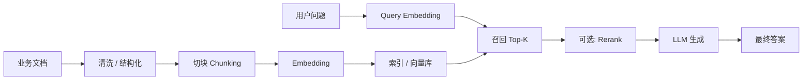
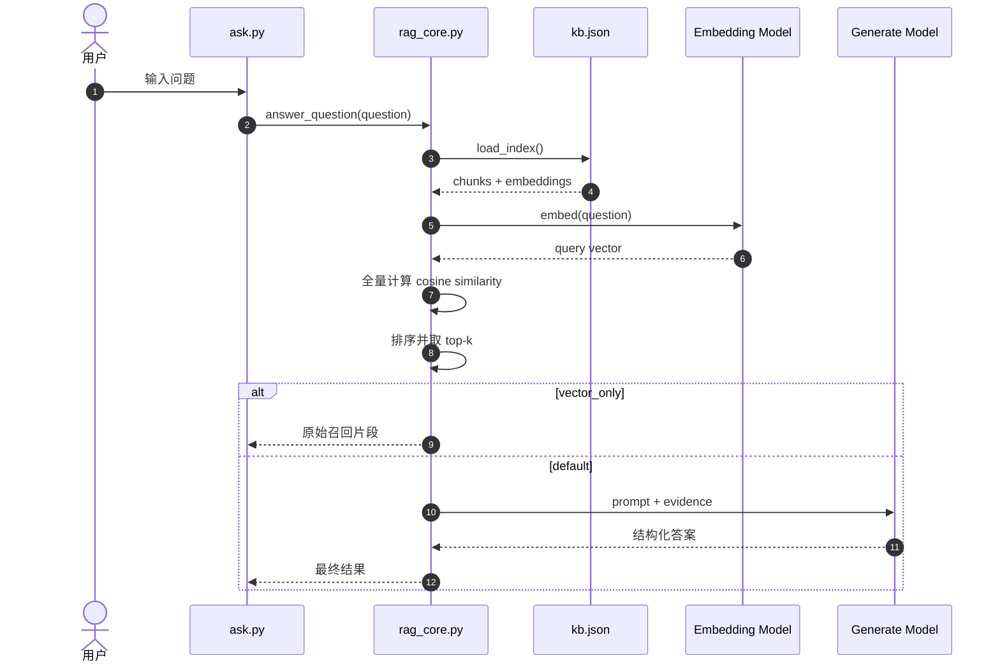
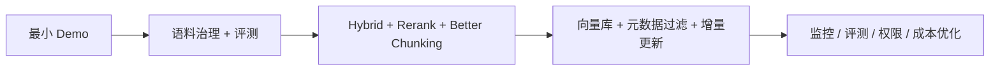

# 从一个最小可运行 Demo 讲清楚 RAG：原理、工程实现与演进路径

## 适用场景
- 组内技术分享
- 时长：20~30 分钟
- 目标：让大家听完后，既能理解 RAG 的本质，也能看懂一个最小 demo 到工程化系统之间差了什么

---

## 一、这场分享最适合怎么讲

这场分享不建议讲成“RAG 基础概念大全”。

更好的讲法是：

**用你已经跑通的本地 demo，讲清楚 RAG 的完整闭环，然后顺势讲它和工程化系统的差距，以及下一步怎么演进。**

因为你的 demo 已经有很好的教学价值：
- 有离线入库
- 有在线问答
- 有向量检索
- 有生成回答
- 有简单评测
- 还有 `--vector_only` 这种特别适合教学的对照模式

一句话概括这场分享的主线：

> 当前 demo 的价值，不在于它已经是完整产品，而在于它已经把 RAG 最关键的工程骨架跑通了。

---

## 二、什么是 RAG

RAG = Retrieval-Augmented Generation，中文通常叫“检索增强生成”。

最通俗的解释：

> 不让模型只靠自己“脑子里记住的东西”回答，而是让它先去知识库里找资料，再基于资料回答。

所以 RAG 解决的不是“让模型更聪明”，而是：
- 让回答有依据
- 让知识可以更新
- 让模型能用企业私有数据
- 让答案更可解释、可追溯

你可以把它理解成两段：

1. **检索**：先找相关资料
2. **生成**：再根据资料组织答案

所以 RAG 不是单纯的“搜索”，也不是单纯的“聊天”，而是：

**先找证据，再写答案。**

---

## 三、标准 RAG 项目长什么样

一个标准 RAG 项目，通常包含 7 个核心环节：

1. 数据接入：把 FAQ、SOP、文档、网页、PDF 等接进来
2. 文档处理：清洗、切块、结构化
3. 向量化：把 chunk 变成 embedding
4. 建索引：存入向量索引 / 向量数据库
5. 检索：根据用户问题召回 top-k 证据
6. 重排：进一步把最相关的证据排到前面
7. 生成：把证据拼进 prompt，让模型输出最终答案

更完整一点，还应该再加两层：
- **评测**：检索质量和最终回答质量要能回归验证
- **观测**：延迟、召回质量、命中率、失败样本要能追踪

### 图 1：标准 RAG 链路

这条链里最重要的不是“模型”，而是：

**数据质量、切块策略、检索质量、上下文组织方式。**

---

## 四、你的 demo 到底是什么

基于你当前的梳理，这个 demo 可以定义为：

> 一套“本地 JSON 索引 + Gemini Embedding + Gemini Generate”的最小可运行 RAG 闭环。

它的核心流程是：

### 离线链路
- 读取 `docs/` 下文档
- 切块
- 调用 embedding 模型生成向量
- 把文本、元信息、向量写入 `data/chroma/kb.json`

### 在线链路
- 读取本地 `kb.json`
- 把用户问题转成向量
- 对所有 chunk 做余弦相似度计算
- 选出 top-k 证据
- 把证据拼进 prompt
- 让生成模型输出结构化答案

### 关键点
这个 demo 虽然目录里叫 `data/chroma/`，但当前并没有真正使用 Chroma 向量数据库。

它的检索本质是：

**本地 JSON 索引 + Python 全量相似度扫描。**

这正是它特别适合做分享的地方：
- 每一步都很透明
- 没有大框架把底层逻辑遮住
- 大家容易理解“RAG 到底在干什么”

---

## 五、用这个 demo 讲清楚一次工单问题是怎么被处理的

你分享时，不要先从定义讲，最好先从一个业务问题开场。

例如：

> 用户问：“工单时效有问题”

然后按这个顺序讲：

1. 先把这句话做 embedding
2. 去本地知识库里找最相近的 chunk
3. 返回 top-k 证据
4. 如果是 `--vector_only` 模式，就直接展示召回到的原始片段
5. 如果是默认模式，就把这些片段交给生成模型做归纳、压缩和结构化输出

### 图 2：你的 demo 在线问答链路

这里最值得强调的结论只有一句：

> **向量检索解决“找到什么”，大模型生成解决“怎么回答”。**

---

## 六、分享里必须讲清楚的 4 个基础概念

### 1. 向量 / Embedding 是什么

向量不是“答案”，而是内容的**语义坐标**。

一句话、一个段落、一篇 FAQ，都可以变成一组数字。语义接近的内容，在向量空间里就会更接近。

你要强调：
- 检索时通常不是一个字一个字去匹配
- 而是把“整句话 / 整个 chunk”编码成向量，再比相似度
- 所以它更像“按意思找”，不是“按字找”

### 2. 向量数据库是什么

向量数据库的作用不是“让文本变成向量”，而是：

**高效存储、索引、过滤、召回大量向量。**

你现在的 demo 还没到这一步。

当前做法是全量扫描，所以数据量一大，延迟和成本都会上去。

### 3. Top-K 是什么

Top-K 的意思是：

**从所有候选 chunk 里，取最相似的前 K 个。**

例如：
- top_k = 3：取最相关的 3 条
- top_k = 5：取最相关的 5 条

这里的 top-k 是“召回结果数”，不是 Transformer 里的采样概念。

### 4. 为什么 RAG 里还要模型

很多人会问：

> 既然都检索到了，为什么还要 LLM？直接把原文返回不就行了吗？

答案是：

直接返回原文，只适合“我只想看材料”的场景。

但真实业务里，通常还需要模型做这几件事：
- 归纳多段证据
- 压缩冗余信息
- 组织成用户能读懂的话
- 输出固定 JSON 结构
- 给出置信度 / 是否转人工 / 风险等级

所以：

**检索给的是“材料”，生成给的是“可直接使用的答案”。**

---

## 七、分片为什么是 RAG 的关键

你的 demo 当前用的是固定切块：
- `chunk_size = 600`
- `chunk_overlap = 120`

这是最常见、最容易上手的方案，适合最小 demo。

但分享里一定要讲清楚：

**chunking 不是预处理小细节，而是 RAG 召回质量的核心变量。**

### 固定切块的优点
- 实现简单
- 性能可控
- 便于实验

### 固定切块的问题
- 切太大：噪声多，召回了很多无关内容
- 切太小：语义不完整，模型看不懂上下文
- 容易把表格、段落、步骤、标题截断

### 更工程化的切块方向
对于 FAQ、SOP、制度文档这类业务语料，更好的方向通常是：
- 按标题层级切
- 按段落边界切
- 表格单独成块
- FAQ 一问一答成块
- SOP 一步一块或一节一块
- PDF / Office 文档先转 Markdown，再按结构切

一句话概括：

> **切块的目标不是“切得均匀”，而是“切得可检索、可理解、可引用”。**

---

## 八、本地 demo 和真实工程化 RAG 的差异

这部分是你分享里最容易拉开层次的地方。

### 1. 索引层
**Demo：** 本地 `kb.json`

**工程化：** 向量数据库 / 向量索引服务
- 支持 ANN
- 支持元数据过滤
- 支持权限隔离
- 支持增量更新
- 支持多租户

### 2. 检索层
**Demo：** 全量 cosine similarity 扫描

**工程化：** 近似最近邻检索（ANN）
- 更低延迟
- 更低成本
- 允许少量 recall 损失换取规模能力

### 3. 召回策略
**Demo：** Dense retrieval only

**工程化：** 常见是 Hybrid Retrieval
- 向量检索负责语义召回
- BM25 / 关键词检索负责精确命中
- 尤其适合术语、编码、日期、名字、业务 jargon

### 4. 排序层
**Demo：** 直接用相似度排序

**工程化：** 常加入 rerank
- 先粗召回更多 chunk
- 再用 reranker 精排
- 让真正最相关的证据进上下文

### 5. 数据治理
**Demo：** FAQ、SOP、学习记录、分享稿可能混在一起

**工程化：** 语料分库、分域、分权限
- 哪类内容可以被问答
- 哪类只用于学习
- 哪类需要权限过滤

### 6. 评测层
**Demo：** 更像 smoke test

**工程化：** 至少拆成两层评测
- 检索质量：命中正确文档没有
- 回答质量：是否 grounded、是否完整、是否答非所问

这部分最适合你总结成一句：

> Demo 是“证明链路可行”，工程化是“让链路可控、可扩展、可评测”。

---

## 九、本地相似度计算和真实向量检索有什么差异

这是你问题里非常好的一个点。

### 当前 demo
- 把 query 向量和所有 chunk 向量逐个比
- 这是 **exact KNN / exhaustive search** 的思路
- 优点：实现简单、结果直观、适合教学
- 缺点：数据量一大就慢

### 真实向量检索
一般不会全量扫，而是使用 ANN 索引结构，例如：
- HNSW
- IVF
- PQ 等

目标是：

**不必比较所有向量，也能很快找到“足够接近”的 top-k。**

所以真实工程里的 tradeoff 是：
- 更低延迟
- 更低成本
- 接受少量 recall loss

你可以直接讲一句非常落地的话：

> 数据少时，全量相似度计算是最容易理解的；数据一大，就必须进入“索引和检索算法”这一层。

---

## 十、什么时候用 RAG，什么时候再调用一次模型

### 适合用 RAG 的场景
- 企业知识库问答
- FAQ / SOP / 制度查询
- 客服辅助回答
- 私有文档问答
- 需要引用来源
- 知识经常更新

### 只检索、不生成也可以的场景
- 只想给人工客服看原始资料
- 只做相似 FAQ 推荐
- 只做证据召回

### 检索后还需要模型的场景
- 要把多段证据合并成一句可读答案
- 要做结构化输出
- 要给出 handoff / confidence / risk level
- 要把原始文档语言转成用户语言

### 不适合只靠 RAG 的场景
如果你要的是**高度确定、零歧义、强规则**的答案，例如：
- SLA 时效精确计算
- 金额结算
- 权益核算
- 规则判断必须 100% 一致

那更合理的方式通常是：

**RAG 负责找规则文本，规则引擎 / SQL / 工具调用负责给最终精确值。**

不要把所有精确业务逻辑都交给自由生成。

---

## 十一、RAG、提示词、微调之间怎么选

这是很容易被问到的一页，建议直接讲成决策逻辑。

### 1. Prompt / 长上下文
适合：
- 小规模
- 静态知识
- 临时验证

### 2. RAG
适合：
- 私有知识
- 高频更新知识
- 需要来源引用
- 需要按用户权限控制上下文

### 3. 微调 / SFT
适合：
- 稳定、重复的任务模式
- 例如分类、结构化抽取、固定风格输出
- 目标不是“记新知识”，而是“学稳定行为”

### 4. 最佳实践通常是组合
最常见的工程组合是：

**RAG 提供知识，Prompt 约束输出，微调改善稳定行为。**

例如：
- 用 RAG 找政策条文
- 用 prompt 约束 JSON 格式
- 用微调让模型更稳定地做客服分类 / 风险打标

一句话总结：

> RAG 解决“知识从哪来”，微调解决“模型怎么做事”。

---

## 十二、你的 demo 下一步怎么往工程化扩展

建议你按“三阶段演进”来讲，而不是一口气讲所有高级能力。

### 阶段 1：把 demo 变稳
- 把语料边界收敛：FAQ、SOP、学习资料分开
- 建立固定评测集
- 明确 top-k、chunk size、overlap 的实验方法
- 把引用、置信度、handoff 做稳定

### 阶段 2：把检索做好
- Query / Document embedding 分离优化
- 引入 hybrid retrieval
- 引入 rerank
- 结构化 chunking / semantic chunking
- 元数据过滤

### 阶段 3：把系统做成工程
- 真正接向量数据库
- 增量入库
- 权限控制
- 观测与日志
- 检索和回答双层评测
- 成本与延迟优化

### 图 3：演进路线图

---

## 十三、你提的 12 个问题，分享时可以这样答

### Q1：RAG 是什么，有什么作用？
RAG 是“先检索、再生成”。作用是让模型基于可更新、可追溯、可引用的外部知识回答，而不是只依赖训练时记住的知识。

### Q2：RAG 标准项目应用是什么样？
典型链路是：数据接入 → 文档处理 → 切块 → embedding → 索引 → 检索 → 重排 → 生成 → 评测。

### Q3：向量基础、向量数据库怎么讲？
向量是语义坐标；向量数据库是高效存储、索引、过滤和召回这些语义坐标的系统。

### Q4：本地 demo 对照怎么讲？
最简单：把 demo 当成“标准 RAG 的最小缩影”，一一映射到正式链路上。

### Q5：IKB 项目 RAG 逻辑怎么讲？
如果你没有 IKB 的完整技术细节，别硬讲“实现细节”，而是讲“对账框架”：
- 索引介质
- chunking
- 召回方式
- 是否 hybrid
- 是否 rerank
- 是否有权限过滤
- 是否有评测与监控

### Q6：demo 如何分片，IKB 如何分片？
Demo 是固定窗口切块；企业系统更推荐结构化 / 语义化切块，尤其是 FAQ、SOP、表格和制度文本。

### Q7：以后有哪些拓展点？
从语料治理、chunking、hybrid retrieval、rerank、向量数据库、评测、权限、监控一路扩展。

### Q8：本地相似度计算和真实向量检索有什么差异？
前者是教学友好的全量扫描；后者依赖 ANN 索引，目标是在大规模数据下保持低延迟和可接受的召回率。

### Q9：Top-K 是什么意思，对应到 Transformer 中什么？
在 RAG 里，top-k 指“召回前 k 个最相关 chunk”。它不等于这里要讲的 Transformer 采样或注意力里的 top-k。

### Q10：RAG 先检索答案，那模型在其中起什么作用？
检索找到的是材料，不是最终回答。模型负责阅读、整合、压缩、格式化，以及输出业务可用答案。

### Q11：如果 RAG 成本也很高，那不如直接本地训练大模型？
这两者优化的不是同一个问题。训练 / 微调是在模型参数里“固化行为或知识”；RAG 是把知识放在模型外面，方便更新、审计和权限控制。知识频繁变动时，RAG 往往更合理。

### Q12：RAG 可不可以微调，如何微调？
可以，而且经常应该组合使用。通常不是为了“把知识微调进去”，而是为了让模型在固定任务上更稳定，比如分类、抽取、结构化输出、品牌语气等。

---

## 十四、没有 IKB 细节时，怎么做对账

如果你想把“demo 和 IKB 对账”也讲进去，但手上还没有完整实现细节，建议在分享里只做下面这张表，不要编实现。

| 对账维度 | 当前 Demo | IKB 实际实现（待填） |
|---|---|---|
| 索引介质 | 本地 `kb.json` |  |
| 检索算法 | 全量 cosine similarity |  |
| 召回策略 | Dense only |  |
| 分片 | 固定窗口 600/120 |  |
| 重排 | 无 |  |
| 元数据过滤 | 基本无 |  |
| 权限控制 | 无 |  |
| 评测 | 简单回归 / smoke test |  |
| 观测 | 较弱 |  |

这个表最大的价值不是“填满”，而是让大家明白：

**一个 RAG demo 到企业级 RAG 平台，中间到底多了哪些能力层。**

---

## 十五、分享结尾可以直接用这段

> 当前这个 RAG demo 已经把最关键的闭环跑通了：文档入库、向量检索、证据约束生成、批量回归验证。它的价值不在于“已经是完整产品”，而在于“已经把 RAG 最核心的工程骨架落到了代码上”。
>
> 真正决定 RAG 上限的，不只是模型本身，而是文档质量、切块策略、召回质量、重排能力、评测机制和工程治理。
>
> 所以这次分享真正想回答的问题不是“RAG 能不能做”，而是“一个能跑的 RAG，如何一步步变成一个可控、可扩展、可评测的 RAG 系统”。

---

## 十六、最后的讲法建议

这场分享最好的顺序是：

1. 先用一个工单问题开场
2. 再讲 RAG 的一句话定义
3. 然后讲你的 demo 如何跑完整个链路
4. 再解释向量、top-k、chunking
5. 接着讲 demo 和工程化的差距
6. 最后讲何时用 RAG、何时结合微调与规则系统

这样大家的感受会是：
- 不是在听概念课
- 而是在看一个真实系统是怎么长出来的

