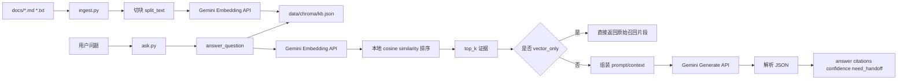

# RAG Demo总览图与讲解话术

## 1. 一句话定义

当前这个 demo 是一个最小可运行的 RAG 闭环：

**先把本地文档切块并向量化保存成索引，再把用户问题向量化做本地检索，最后按需调用大模型基于证据生成答案。**

---

## 2. 一页总览图



---

## 3. 讲解时建议先讲清楚的 3 件事

1. 这个 demo 只做了 3 件事
   - 离线入库：`src/ingest.py`
   - 在线问答：`src/ask.py`
   - 批量评测：`src/evaluate.py`

2. 它最核心的依赖关系很简单
   - `docs/* -> ingest.py -> data/chroma/kb.json -> ask.py / evaluate.py`

3. 它不是企业级检索平台
   - 当前不是向量数据库
   - 当前不是 ANN 检索
   - 当前是本地 JSON 索引 + Gemini API 的最小 RAG demo

---

## 4. 哪些逻辑在本地，哪些逻辑在外部

### 本地逻辑

- 扫描 `docs/` 下文档
- 文本切块和 overlap 处理
- 生成 `chunk_id`
- 保存和加载 `kb.json`
- 读取问题后遍历全部 chunk 做 `cosine_similarity`
- 排序取 `top_k`
- 组装 prompt/context
- 解析 JSON 输出
- 构造 `citations`、`confidence`、`need_handoff`

### 外部服务

- Gemini Embedding API
  - 入库时调用一次批量 embedding
  - 问答时调用一次问题 embedding

- Gemini Generate API
  - 只在默认问答模式调用
  - `--vector_only` 不调用这个接口

---

## 5. 你可以直接照着讲的话术

### 版本一：30 秒

这套 demo 的核心思路很简单。先把 `docs/` 下的文档做切块，然后调用 embedding 模型把每个 chunk 转成向量，保存到本地 `kb.json`。用户提问时，再把问题转成向量，在本地对所有 chunk 做余弦相似度排序，找出最相关的 top-k 证据。如果是 `vector_only` 模式，就直接返回这些原始片段；如果是默认模式，就再调用一次生成模型，把检索到的证据整理成最终答案。

### 版本二：1 分钟

这套 demo 本质上分两段。第一段是离线入库，入口是 `src/ingest.py`。它负责读取文档、切块、调用 Gemini Embedding API、然后把向量和原文一起保存进 `data/chroma/kb.json`。第二段是在线问答，入口是 `src/ask.py`。它不会重新扫文档，而是直接读取 `kb.json`，先把用户问题做 embedding，再在本地遍历所有 chunk 做余弦相似度排序，取出最相关的几段证据。之后有两个分支：如果只想演示检索，就用 `--vector_only`，只返回召回片段；如果要演示完整 RAG，就再调用 Gemini Generate API，把证据整理成结构化答案输出。  

所以这个 demo 的价值不在于做得多复杂，而在于它把 RAG 的核心闭环拆得很清楚：入库、检索、生成、评测，各自职责明确，依赖关系也很直观。

---

## 6. 分享时最值得强调的两句话

**向量检索解决的是“找到什么”，大模型生成解决的是“怎么回答”。**

**当前 demo 的重点不是工程复杂度，而是把 RAG 的最小闭环和核心职责拆清楚。**

---

## 7. 现场演示命令

```powershell
python src/ingest.py
python src/ask.py "工单时效有问题"
python src/ask.py "工单时效有问题" --vector_only
python src/evaluate.py
```

---

## 8. 一页总结

如果要把这一页作为 PPT 收尾，可以直接用下面这段：

> 当前这套 RAG demo 已经具备一个完整的最小闭环：文档入库、问题检索、证据生成、批量评测。  
> 它的实现并不追求企业级复杂度，而是有意保留为一个结构透明、便于讲解、便于演示的教学型工程。  
> 它最适合用来解释 RAG 到底做了什么，以及为什么企业场景下往往不是“只靠大模型”，而是“检索 + 生成 + 评测 + 工程治理”的组合。
