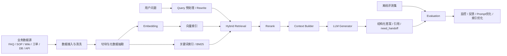
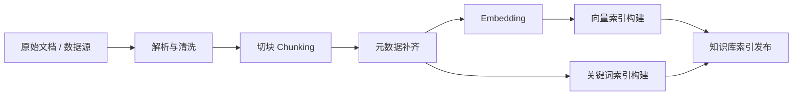
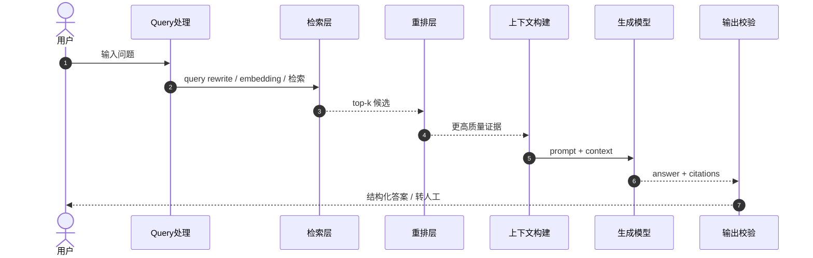
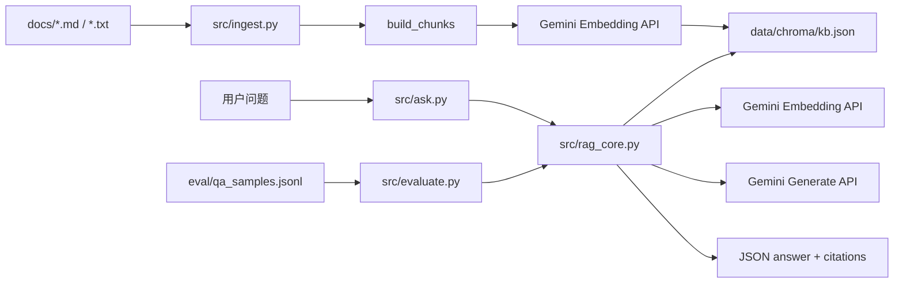
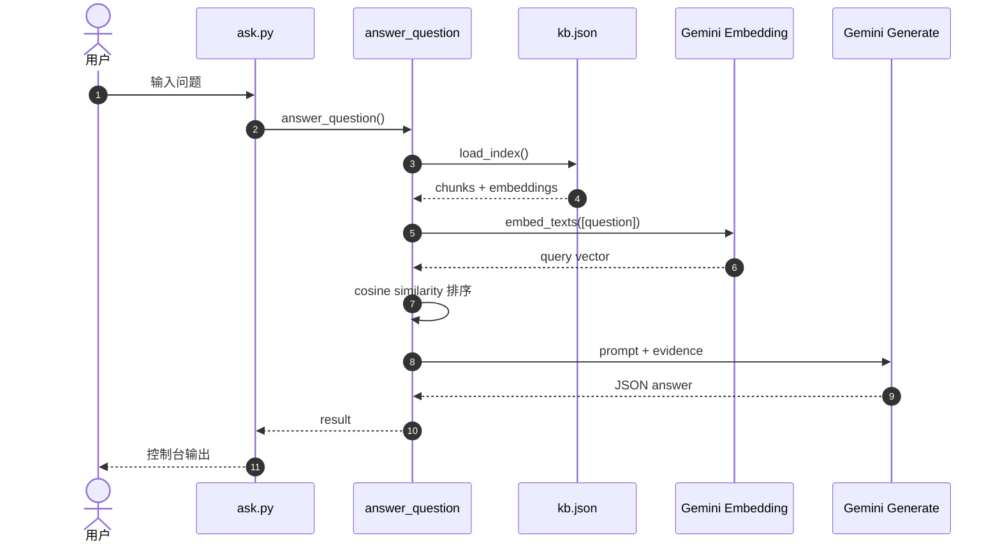

# RAG 技术分享完整版

## 0. 文档定位

这份文档面向一次完整的技术分享，目标不是只解释“RAG 是什么”，而是把下面 4 个层次讲透：

1. RAG 的概念、价值和适用边界
2. 企业级 RAG 的完整架构与流程
3. 当前项目里的 RAG demo 是怎么设计和实现的
4. 从 demo 走向工程化和生产化，还需要补哪些能力

这份文档可以直接用于：

- 技术分享讲稿
- PPT 提纲底稿
- 项目内部设计说明
- 后续工程化拆解的基础材料

---

## 1. 分享目标与建议目录

建议按下面顺序讲：

1. 什么是 RAG，为什么企业需要 RAG
2. 企业级 RAG 的完整架构和数据流
3. 当前项目 demo 的实现与运行方式
4. 当前 demo 的局限和扩展方向
5. 评测、运维、安全、成本这些工程问题怎么补齐

一句话概括这场分享：

**RAG 不是一个模型，而是一套“检索 + 生成 + 评测 + 工程治理”的系统方法。**

---

## 2. RAG 是什么

### 2.1 定义

RAG，Retrieval-Augmented Generation，中文通常叫“检索增强生成”。

核心思想是：

- 先从外部知识源中检索证据
- 再让大模型基于证据生成回答

与纯大模型回答相比，RAG 的关键差异不在“模型更大”，而在“回答时能够引用外部知识”。

### 2.2 为什么企业需要 RAG

企业场景里，纯大模型通常有几个明显问题：

- 知识更新慢，模型训练语料并不等于企业最新知识
- 企业内部 SOP、FAQ、制度、工单规则通常不在通用模型参数里
- 回答无法追溯到来源，合规和审计都很困难
- 很多场景不能接受“听起来很像但其实是错的”答案

RAG 的价值就在于：

- 把知识更新成本从“重新训练模型”降到“更新知识库”
- 让答案可引用、可追溯
- 降低幻觉概率
- 更适合客服、知识库、坐席辅助、内部问答、运维助手这类业务

### 2.3 一句话区分

- 纯大模型：靠参数记忆回答
- RAG：靠“外部证据 + 模型生成”回答

---

## 3. RAG 的适用边界

### 3.1 适合 RAG 的场景

- FAQ、知识库问答
- 企业制度、流程、SOP 查询
- 客服辅助、工单辅助
- 产品文档、运维文档、研发知识问答
- 需要引用出处或证据的回答场景

### 3.2 不一定适合 RAG 的场景

- 纯创作类内容
- 完全不依赖外部知识的开放式聊天
- 极短、极固定、可模板化返回的问答
- 对时延极端敏感且知识更新很少的场景

### 3.3 RAG 与微调不是替代关系

需要明确给听众一个认知：

- 微调解决的是“能力风格和任务习惯”
- RAG 解决的是“知识来源、时效性、可追溯”

很多企业最终落地的是：

**基础模型 + RAG + 少量任务级微调**

---

## 4. 企业级 RAG 的完整架构

企业级 RAG 不只是“向量检索 + 大模型”这么简单，至少应包含 4 层：

1. 数据层
2. 检索层
3. 生成与编排层
4. 评测与治理层

### 4.1 图 1：企业级 RAG 总体架构图



### 4.2 企业级链路拆解

#### 数据层

负责把原始知识整理成可检索形态。

包括：

- 多源接入
- 文本清洗
- 结构化抽取
- 切块
- 元数据补充
- 权限标签

#### 检索层

负责从大规模知识中找出最相关证据。

通常包括：

- Dense retrieval
- Sparse retrieval
- Hybrid retrieval
- Rerank

#### 生成与编排层

负责把证据变成适合用户的答案。

通常包括：

- Prompt 组织
- 引用格式化
- 拒答策略
- need_handoff 策略
- 输出结构化

#### 治理层

这是很多分享容易漏掉、但企业最关心的部分。

至少应该包括：

- 离线评测
- 在线监控
- 日志审计
- 权限控制
- 成本监控
- 版本管理

---

## 5. 企业级 RAG 的完整流程

企业级 RAG 可以分为两段：

- 离线索引构建流程
- 在线问答流程

### 5.1 图 2：离线索引构建流程图



### 5.2 图 3：在线问答数据流时序图



### 5.3 这部分分享时建议强调

- 离线阶段解决“知识如何准备”
- 在线阶段解决“问题如何回答”
- 真正决定效果的不只是模型，还有检索质量和评测体系

---

## 6. 当前项目里的 RAG Demo

这一部分是分享的核心落地点，要把抽象企业架构和当前项目连接起来。

### 6.1 当前 demo 的一句话定义

当前 demo 是一个“本地 JSON 索引 + Gemini Embedding + Gemini Generate”的最小可用 RAG 实现。

### 6.2 当前 demo 的组件划分

| 组件 | 文件 | 作用 |
|---|---|---|
| 离线入库 | `src/ingest.py` | 读文档、切块、向量化、生成本地索引 |
| 在线问答 | `src/ask.py` | 单次提问入口 |
| 核心逻辑 | `src/rag_core.py` | 检索、生成、解析、引用 |
| 批量评测 | `src/evaluate.py` | 回归验证 |
| 实验 profile | `src/week3_ingest_runner.py` | 试不同 chunk 参数 |
| 本地索引 | `data/chroma/kb.json` | 存储 chunks 和 embeddings |

### 6.3 当前 demo 的真实特点

- 当前索引是 JSON 文件，不是真正的向量数据库
- 当前检索是本地全量遍历，不是 ANN
- 当前主要是 dense retrieval，没有 BM25 和 rerank
- 当前支持结构化输出、citation、need_handoff

### 6.4 图 4：当前 demo 架构图



---

### 6.5 当前 demo 实际只做了 3 件事

如果听众对当前 demo 的印象还是“好像有很多脚本，但不清楚它们各自负责什么”，建议直接用下面这张职责拆解来讲：

1. 离线入库
   - 入口：`src/ingest.py` / `src/week3_ingest_runner.py`
   - 作用：读取 `docs/` 下的文档，切块，生成文档向量，保存本地索引

2. 在线问答
   - 入口：`src/ask.py`
   - 核心：`src/rag_core.py` 里的 `answer_question()`
   - 作用：读取本地索引，对用户问题做检索，再决定是否调用生成模型输出答案

3. 批量评测
   - 入口：`src/evaluate.py`
   - 作用：批量执行问答流程，并做一个轻量回归评分

一句话讲清楚：

**这个 demo 不是一个“大而全的平台”，而是一个围绕“入库、问答、评测”三条链路搭起来的最小可运行 RAG 闭环。**

### 6.6 当前 demo 的顺序与依赖关系

这套 demo 最核心的依赖关系其实非常简单：

```text
docs/*
  -> ingest.py
  -> data/chroma/kb.json
  -> ask.py / evaluate.py
```

这意味着：

- `ask.py` 和 `evaluate.py` 不直接读取 `docs/`
- 它们依赖的是 `ingest.py` 预先生成好的 `data/chroma/kb.json`
- 如果还没有执行过入库，问答流程就无法开始

可以把整个 demo 分成两个阶段：

1. 知识准备阶段
   - 源文档放在 `docs/`
   - 执行 `ingest.py`
   - 生成本地索引 `kb.json`

2. 知识使用阶段
   - `ask.py` 执行单次问答
   - `evaluate.py` 执行批量问答与评分

### 6.7 当前 demo 调用了哪些外部服务，本地又做了什么

这部分非常值得在分享里专门讲清楚，因为它决定了大家对这套 demo 的技术边界判断是否准确。

#### 外部服务

当前 demo 只调用了 2 类外部服务，都是 Gemini：

1. Gemini Embedding API
   - 入库时调用：把每个 chunk 转成向量
   - 问答时调用：把用户问题转成向量

2. Gemini Generate API
   - 只在默认问答模式调用
   - 用于基于召回证据生成最终答案

补充一点：

- `--vector_only` 模式不会调用生成模型
- 但它仍然会调用 embedding，因为检索本身就需要先把问题向量化

#### 本地处理逻辑

外部服务只负责“算向量”和“生成答案”，其余很多逻辑都在本地完成：

- 读取 `.env` 和模型配置
- 扫描 `docs/` 下的 `.md/.txt`
- 切块与 overlap 处理
- 生成 `chunk_id`
- 把索引保存成 `data/chroma/kb.json`
- 加载本地索引
- 遍历全部 chunk 做 `cosine_similarity`
- 排序取 `top_k`
- 拼接 context / prompt
- 解析 JSON 输出
- 构造 citations / confidence / need_handoff
- 处理 429 重试和简单容错

这里一定要强调一个事实：

**当前 demo 的检索不是向量数据库检索，而是“加载本地 JSON 索引后，对全部 chunk 做本地余弦相似度排序”。**

所以它的真实定位是：

**本地 JSON 索引 + Gemini API 的最小 RAG demo，而不是企业级向量检索平台。**

## 7. 当前 demo 的数据流与时序

### 7.1 离线入库流

当前离线入库流程是：

1. 从 `docs/` 读取 `.md/.txt`
2. 按固定窗口切块
3. 调用 embedding
4. 写入 `kb.json`

### 7.2 在线问答流

当前在线问答流程是：

1. 读取 `kb.json`
2. 把用户问题做 embedding
3. 遍历全部 chunk 做 cosine similarity
4. 取 top-k 证据
5. 组装 prompt
6. 调用生成模型
7. 输出结构化 JSON

### 7.3 图 5：当前 demo 在线问答时序图



### 7.4 当前 demo 的优点

- 链路非常清晰
- 数据结构很透明
- 适合教学和分享
- 已经具备最小容错与回归能力

### 7.5 当前 demo 的边界

- 没有真正的向量库
- 没有 hybrid retrieval
- 没有 rerank
- 语料边界需要更严格
- 评测还比较轻

---

## 8. 当前 demo 中最值得补充给听众的内容

你原先想讲 4 点：

1. 介绍 RAG 是什么
2. 企业级 RAG 的完整架构及流程
3. 讲我的 RAG demo
4. 讲 RAG demo 后续扩展点和工程化

这 4 点是对的，但如果要做成高质量分享，建议再补 6 个维度。

### 8.1 需要补充的内容一：为什么企业需要 RAG

不能一上来只讲定义，要先讲业务痛点：

- 纯大模型知识不新
- 企业知识不在模型参数里
- 需要可追溯
- 需要可控转人工

### 8.2 需要补充的内容二：RAG 的适用边界

要明确：

- RAG 不是万能解
- 不是所有问题都应该走 RAG
- 不是所有场景都必须依赖生成模型

### 8.3 需要补充的内容三：评测体系

这个是高质量分享里很容易加分的一部分。

要讲清：

- 召回层怎么评测
- 生成层怎么评测
- 当前 demo 的 `evaluate.py` 只能做什么
- 未来需要补哪些指标

### 8.4 需要补充的内容四：权限、安全与合规

企业级分享不能只讲算法，还要讲：

- 权限过滤
- 敏感信息
- 引用审计
- 日志治理

### 8.5 需要补充的内容五：成本与性能

推荐补充：

- 检索成本
- 生成成本
- 延迟来源
- 向量库和 rerank 对时延的影响

### 8.6 需要补充的内容六：运维与观测

建议补上：

- 请求成功率
- 429 限流治理
- 失败重试
- 指标监控
- 版本回滚

---

## 9. 从 demo 到工程化，需要补哪些能力

这一部分是“分享高级感”的来源。

### 9.1 检索层增强

- 向量库或 ANN 索引
- BM25 / sparse retrieval
- hybrid retrieval
- rerank

### 9.2 数据层增强

- 严格划分业务知识和学习笔记
- 增量入库
- 去重
- 更丰富的 metadata
- 文档版本和更新时间管理

### 9.3 生成层增强

- 更严格的 prompt 约束
- 更稳定的 JSON schema
- 输出校验
- need_handoff 策略优化

### 9.4 评测层增强

- Recall@K
- MRR / nDCG
- Faithfulness
- Citation Precision
- 人工标注集

### 9.5 平台层增强

- 权限控制
- 多知识库
- 模型路由
- 缓存
- 监控告警
- 成本统计

---

## 10. 你这次分享里最适合画的图

如果你想把“架构设计、数据流向、时序”讲清楚，建议至少画这 6 张图：

1. 企业级 RAG 总体架构图
2. 离线索引构建流程图
3. 在线问答数据流时序图
4. 当前 demo 架构图
5. 当前 demo 在线问答时序图
6. 有模型 vs 无模型 对比图

如果你的分享更偏“工单”场景，再补 2 张：

7. 工单业务泳道图
8. need_handoff / 转人工决策图

---

## 11. 有模型 vs 无模型，这一页一定值得讲

当前 demo 已经支持：

```powershell
python src/ask.py "工单时效有问题"
python src/ask.py "工单时效有问题" --vector_only
```

这页的价值很大，因为它能清楚回答一个关键问题：

**既然向量检索已经能找到证据，为什么还要再调一次大模型？**

答案是：

- 无模型模式返回的是原始片段
- 有模型模式返回的是整理后的答案

所以：

**向量检索解决“找到什么”，大模型生成解决“怎么回答”。**

---

## 12. 分享时建议的讲法

### 12.1 开头

先从业务痛点切入：

“企业知识更新快、来源杂、要求可追溯，纯大模型很难稳定解决，所以我们需要 RAG。”

### 12.2 中段

再讲企业级完整架构：

- 数据层
- 检索层
- 生成层
- 评测与治理层

### 12.3 落到项目

然后切到你自己的 demo：

- 现在怎么实现
- 现在能跑什么
- 现在缺什么

### 12.4 结尾

最后讲工程化路线：

- 从 demo 到平台
- 从能跑到可治理
- 从单机到生产

---

## 13. 一页总结

你可以直接用下面这段做结尾：

> RAG 的本质不是“给大模型加一个检索步骤”，而是把企业知识、检索系统、生成模型、评测机制和工程治理整合成一套完整系统。  
> 当前项目的 demo 已经把最核心的闭环跑通了：离线入库、在线检索、证据约束生成、批量回归验证。  
> 下一步真正要做的，不是简单堆功能，而是围绕检索质量、数据边界、评测体系、权限治理、成本与性能，把 demo 逐步推进成工程化方案。

---

## 14. 最终建议

如果你这次分享是 20 到 30 分钟，推荐按这个比例分配：

- 20%：RAG 定义与企业价值
- 25%：企业级架构与流程
- 30%：当前 demo 讲解
- 15%：工程化扩展点
- 10%：问题与答疑

这样分享既不会太虚，也不会只停留在 demo 层面。
