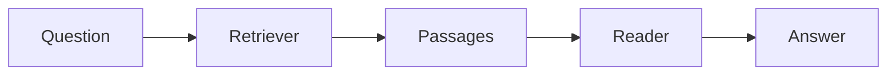
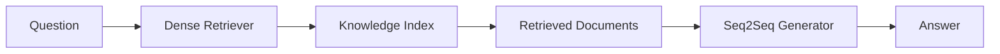
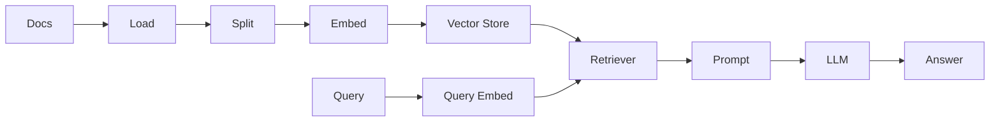
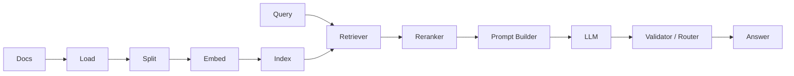
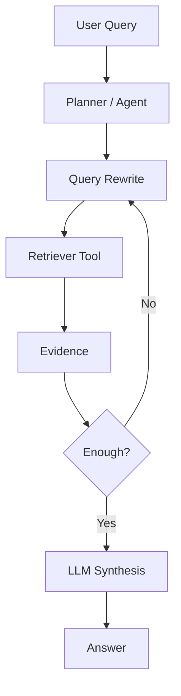
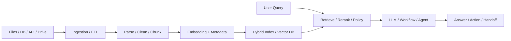
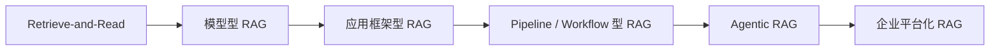

# RAG框架发展过程

## 1. 文档定位

这份文档用于回答一个在技术分享里很常见、也很关键的问题：

**RAG 框架到底是怎么一步步发展到今天这个形态的？**

这部分内容的价值在于：

- 帮听众建立时间线
- 帮听众理解为什么现在会出现这么多不同形态的 RAG 框架
- 帮你把当前 demo 放到行业演进背景里解释清楚

时间口径：`2026-03-25`

---

## 2. 一句话结论

RAG 框架的发展过程，大致可以概括成：

`Retrieve-and-Read -> 模型型 RAG -> 应用框架型 RAG -> Pipeline / Workflow 型 RAG -> Agentic RAG -> 企业平台化 RAG`

也就是说，它不是一开始就是今天这种“知识平台”形态，而是从一个研究范式，逐步演进成一套工程体系。

---

## 3. 第一阶段：Retrieve-and-Read

### 时间特征

`2020 年之前`

### 这一阶段的特点

在这一阶段，业界虽然已经有“先检索、再阅读、再回答”的思路，但还没有现在这么成熟的 RAG 框架体系。

核心目标是：

- 给开放域问答系统补充外部知识
- 缓解模型纯靠参数记忆的问题

这一阶段更像是今天 RAG 的前身。

### 典型架构

### 核心特征

- 检索和回答已经分开
- 但整体更偏“问答系统”
- 还没有今天这种 embedding、向量库、工作流、Agent 的完整生态

---

## 4. 第二阶段：模型型 RAG

### 时间特征

`2020 年`

### 标志性事件

RAG 这个名字开始被大范围使用，通常会追溯到 `NeurIPS 2020` 的论文：

`Retrieval-Augmented Generation for Knowledge-Intensive NLP Tasks`

### 这一阶段的特点

这一阶段的重点不是“怎么搭业务系统”，而是“怎么把检索增强生成作为一种模型方法建立起来”。

它主要解决的是：

- 模型知识过时
- 参数知识不可控
- 纯生成容易幻觉

### 典型架构

### 核心特征

- 强调“外部知识 + 生成模型”
- 更偏研究范式
- 还不是面向企业落地的框架

---

## 5. 第三阶段：应用框架型 RAG

### 时间特征

`2023 年前后`

### 代表框架

- `LangChain`
- `LlamaIndex`
- `早期 Haystack RAG 方案`

### 这一阶段的特点

随着大模型应用开始爆发，大家不满足于“论文上的 RAG”，而是需要快速搭一个能跑的知识库问答系统。

于是 RAG 的典型抽象开始稳定下来：

- Loader
- Splitter
- Embedder
- Vector Store
- Retriever
- Prompt
- LLM

### 典型架构

### 这一阶段解决了什么

- 把“RAG”从论文概念变成开发框架
- 让开发者能快速把文档接进模型
- 让 embedding、向量库、生成模型形成清晰链路

### 你当前 demo 与这一阶段的关系

你现在的 demo 最接近这一阶段。

因为它的核心就是：

- 文档切块
- 文档向量化
- 本地索引
- 问题检索
- 大模型生成

只是你现在还没有真正接入企业级向量数据库，而是用本地 JSON 索引做了一个教学型最小闭环。

---

## 6. 第四阶段：Pipeline / Workflow 型 RAG

### 时间特征

`2024 年前后`

### 代表框架 / 方向

- `Haystack 2.x`
- `Dify Workflow`
- `Flowise`
- 很多企业自建的 DAG / Workflow 方案

### 为什么会进入这一阶段

大家很快发现，简单的：

`retrieve -> generate`

在真实业务里不够用，因为还会遇到这些问题：

- 检索结果质量不稳定
- 需要 rerank
- 需要 filter
- 需要 fallback
- 需要输出校验
- 需要人工转接判断

所以 RAG 开始从“一条链”变成“一条可编排流水线”。

### 典型架构

### 核心特征

- 节点化
- 可路由
- 可分支
- 可回退
- 更适合工程治理

### 这一阶段对企业的意义

RAG 不再只是“查到了什么、答了什么”，而开始进入：

- 怎么调度
- 怎么校验
- 怎么观测
- 怎么容错

这些工程问题。

---

## 7. 第五阶段：Agentic RAG

### 时间特征

`2025 年前后更明显`

### 代表方向

- `LangGraph Agentic RAG`
- `Flowise Agentic RAG`
- `Azure AI Search` 的 `agentic retrieval`

### 为什么会进入这一阶段

大家又发现，很多问题不是一次检索就能解决的。

比如：

- 需要先改写 query
- 需要拆分子问题
- 需要多轮检索
- 需要决定什么时候继续查、什么时候停止查

于是“检索”从固定步骤，变成了 Agent 可以动态调用的一种能力。

### 典型架构

### 核心特征

- 检索次数不固定
- 检索策略可动态调整
- 更像“会思考如何检索”的系统

### 这一阶段的本质变化

从：

- 固定的 RAG 流程

变成：

- 由 Agent 决定检索怎么做

---

## 8. 第六阶段：企业平台化 RAG

### 时间特征

`2025-2026 年趋势明显`

### 代表平台 / 方向

- `RAGFlow`
- `Pathway`
- `Azure AI Search`
- `Amazon Bedrock Knowledge Bases`
- `Vertex AI RAG Engine`

### 为什么会进入这一阶段

企业真正落地时，难点已经不只是：

- 查得到
- 答得出

而是：

- 数据怎么持续接入
- 文档怎么解析
- 知识怎么增量更新
- 权限怎么控制
- 引用怎么审计
- 成本怎么统计
- 效果怎么评测
- 故障怎么运维

所以 RAG 最终走向的是平台化，而不仅仅是链路化。

### 典型架构

### 核心特征

- 不只是问答
- 更强调数据治理
- 更强调检索治理
- 更强调权限、监控、运维、成本

---

## 9. 把整个发展过程压缩成一张图

你在分享时可以直接用这张图讲：

- 最早是“先查再读”
- 后来是“检索增强生成”这个明确范式
- 再后来变成“开发框架”
- 然后变成“工作流和工程体系”
- 现在正在往“Agent 化”和“平台化”演进

---

## 10. 当前主流框架分别处在什么位置

### LangChain / LangGraph

更偏：

- 应用框架型 RAG
- Pipeline / Workflow 型 RAG
- Agentic RAG

它的强项已经不只是经典 RAG，而是编排和 Agent。

### LlamaIndex

更偏：

- 应用框架型 RAG

它最强的是“从文档到索引再到查询”的文档型 RAG 体系。

### Haystack

更偏：

- Pipeline / Workflow 型 RAG

它的强项是 pipeline、组件化和工程可控性。

### Dify / Flowise

更偏：

- Pipeline / Workflow 型 RAG
- 低代码应用装配

它们更像应用交付层。

### RAGFlow / Pathway

更偏：

- 企业平台化 RAG

它们不只做“查和答”，而是做更完整的数据与检索平台。

---

## 11. 你当前 demo 在这条演进线上的位置

最准确的定位是：

**当前 demo 主要属于“应用框架型 RAG”的范畴，同时开始具备一点点 Pipeline 化意识。**

原因是：

- 已经具备完整最小闭环
- 有离线入库、在线问答、批量评测
- 也开始区分检索层和生成层
- 但还没有真正的 DAG、rerank、multi-step retrieval、Agent、权限治理、平台治理

所以在分享时，最适合这样表述：

**当前项目不是企业级平台，而是一个教学型、最小闭环、便于讲清 RAG 原理的 demo。**

这样讲有两个好处：

- 不会把 demo 说得过重
- 又能自然引出后续工程化扩展点

---

## 12. 分享时可以直接用的几句话

### 结论一

**RAG 框架的发展，本质上是从“一个检索增强生成的方法”，逐步演进成“一个包含数据、检索、生成、评测和治理的平台体系”。**

### 结论二

**越往后发展，RAG 的重点越不只是模型，而是编排、检索策略、数据治理、权限治理和运维治理。**

### 结论三

**当前很多框架表面上都在做 RAG，但它们真正的差异，往往在于各自把哪一层做成了自己的核心优势。**

---

## 13. 官方资料

- RAG 原始论文（NeurIPS 2020）  
  https://proceedings.neurips.cc/paper/2020/hash/6b493230205f780e1bc26945df7481e5-Abstract.html

- LangChain Retrieval  
  https://docs.langchain.com/oss/python/langchain/retrieval

- LlamaIndex RAG  
  https://docs.llamaindex.ai/en/stable/understanding/rag/

- Haystack Pipelines  
  https://docs.haystack.deepset.ai/docs/pipelines

- Dify Knowledge Retrieval  
  https://docs.dify.ai/en/use-dify/nodes/knowledge-retrieval

- Flowise Agentic RAG  
  https://docs.flowiseai.com/tutorials/agentic-rag

- Azure Agentic Retrieval  
  https://learn.microsoft.com/en-us/azure/search/search-agentic-retrieval-concept

- Pathway RAG Template  
  https://pathway.com/developers/templates/rag/_readmes/question_answering_rag/

- RAGFlow  
  https://ragflow.io/
