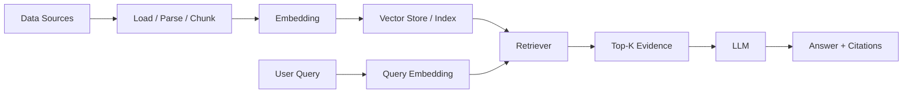
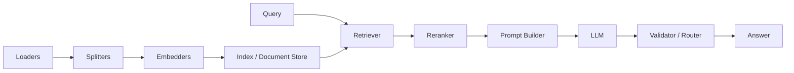
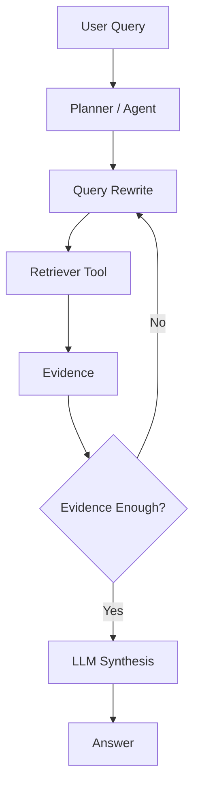
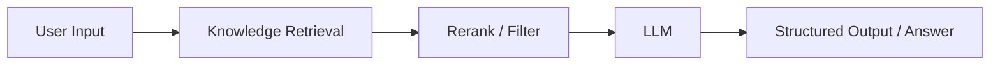
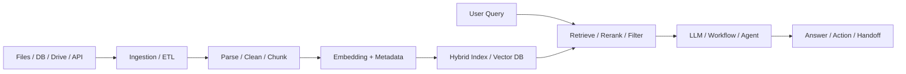

# 主流RAG框架与架构图对比

## 1. 文档定位

这份文档用于补充技术分享里的“行业方案视角”。

目标不是把所有 RAG 框架逐个展开，而是回答 3 个更关键的问题：

1. 现在市面上主流的 RAG 框架有哪些
2. 它们的架构通常长什么样
3. 在技术分享里，应该怎么把这些框架讲清楚

时间口径：`2026-03-25`

---

## 2. 先给结论：主流 RAG 框架不是一类东西

现在常见的 RAG 方案，最好分成 3 类来看：

1. 代码框架
   - 代表：`LangChain / LangGraph`、`LlamaIndex`、`Haystack`
   - 特点：自己写代码，灵活度高，适合工程化定制

2. 低代码 / 可视化平台
   - 代表：`Dify`、`Flowise`
   - 特点：拖拽式工作流，适合快速做 Demo、PoC、业务应用

3. 托管式平台 / 云厂商方案
   - 代表：`Azure AI Search`、`Amazon Bedrock Knowledge Bases`、`Vertex AI RAG Engine`
   - 特点：把 ingestion、index、retrieval、部分编排交给云平台托管

如果再往企业平台化方向走，还会出现一类一体化方案：

- `RAGFlow`
- `Pathway`

它们更强调文档处理、混合检索、重排、实时索引、工作流编排这些平台能力。

---

## 3. 主流框架清单

| 类别 | 代表框架/平台 | 核心定位 | 更适合什么场景 |
|---|---|---|---|
| 代码框架 | LangChain / LangGraph | 编排、Agent、工具调用 | 复杂链路、Agentic RAG |
| 代码框架 | LlamaIndex | 数据接入、索引、查询 | 文档型 RAG、知识库问答 |
| 代码框架 | Haystack | 显式 pipeline / DAG | 生产级流程、路由、可控性 |
| 低代码平台 | Dify | 应用装配、知识库工作流 | 业务快速上线 |
| 低代码平台 | Flowise | 可视化流程编排 | Demo、PoC、轻量应用 |
| 一体化平台 | RAGFlow | 企业知识库平台 | 中文场景、企业检索增强 |
| 实时数据框架 | Pathway | 实时索引、持续更新 | 数据频繁变化的场景 |
| 托管平台 | Azure AI Search | 检索基础设施 + RAG | Azure 生态 |
| 托管平台 | Bedrock Knowledge Bases | 托管式知识库 RAG | AWS 生态 |
| 托管平台 | Vertex AI RAG Engine | 托管式 RAG 数据框架 | GCP 生态 |

---

## 4. 它们的架构图通常是什么样的

### 4.1 经典两段式 RAG

这是最经典、最容易讲清楚的一种架构。

适用框架：

- `LlamaIndex` 基础 RAG
- `Flowise` 基础知识库流程
- `Bedrock Knowledge Bases`
- 你现在这个 demo

架构特点：

- 离线阶段构建索引
- 在线阶段检索证据
- 最后调用生成模型回答

一句话解释：

**先把知识变成可检索索引，再把检索结果交给大模型生成答案。**

---

### 4.2 Pipeline / DAG 型 RAG

这是工程化里最常见的一种形态。

适用框架：

- `Haystack`
- `Dify` 复杂工作流
- 很多企业自建 RAG 中台

架构特点：

- 各个步骤拆成明确节点
- 支持分支、路由、校验、回退
- 适合加入 rerank、filter、guardrail、fallback

一句话解释：

**把 RAG 拆成可编排、可路由、可治理的流水线。**

---

### 4.3 Agentic RAG

这是近两年非常常见的一类架构。

适用框架：

- `LangGraph`
- `Flowise Agentic RAG`
- `Azure AI Search` 的 agentic retrieval 思路

架构特点：

- 不再固定只检索一次
- 会先规划、改写 query、决定调用哪些工具
- 如果证据不足，会继续检索或换策略

一句话解释：

**检索不再是固定步骤，而是成为 Agent 可动态调用的能力。**

---

### 4.4 低代码工作流型

这是业务团队最容易接受的展示方式。

适用框架：

- `Dify`
- `Flowise`

架构特点：

- 用节点把输入、检索、模型、输出串起来
- 更适合应用交付，不是底层算法研究
- 方便快速验证知识库问答、客服助手、内部助手

一句话解释：

**把 RAG 从“代码实现”变成“应用装配”。**

---

### 4.5 一体化企业平台型

这是企业级分享里最适合用来拉开视野的一类架构。

适用框架/平台：

- `RAGFlow`
- `Pathway`
- 一些云厂商托管平台

架构特点：

- 文档接入更复杂
- 支持 OCR、解析、清洗、混合检索、重排、权限控制
- 有时还会加入实时同步、增量索引、多租户能力

一句话解释：

**RAG 不只是问答链路，而是一套包含数据治理、检索治理、生成治理的平台。**

---

## 5. 各框架最典型的“设计重心”

### LangChain / LangGraph

最适合这样讲：

- 强项不只是 RAG 本身，而是复杂编排
- 更偏 `Agent + Tool + Graph`
- 适合多步推理、路由、反复检索、外部工具调用

分享里的关键词：

- `2-Step RAG`
- `Agentic RAG`
- `Hybrid RAG`

### LlamaIndex

最适合这样讲：

- 强项是“从文档到索引，再到查询”的全过程
- 比较适合文档型知识库场景
- 对“节点、索引、查询引擎”的抽象比较自然

分享里的关键词：

- `Loading`
- `Indexing`
- `Storing`
- `Querying`
- `Evaluation`

### Haystack

最适合这样讲：

- 强项是 pipeline
- 结构显式、治理感强
- 适合工程团队把检索、重排、路由、生成拆清楚

分享里的关键词：

- `components`
- `pipelines`
- `directed multigraph`

### Dify / Flowise

最适合这样讲：

- 强项是应用交付效率
- 适合知识库机器人、客服助手、内部问答
- 低代码形态非常适合给非研发同学展示

分享里的关键词：

- `workflow`
- `knowledge retrieval`
- `visual orchestration`

### RAGFlow / Pathway

最适合这样讲：

- 强项在企业平台能力
- 不只关注“查一次、答一次”
- 更关心实时同步、混合检索、重排、文档理解

分享里的关键词：

- `hybrid search`
- `rerank`
- `real-time indexing`
- `enterprise knowledge platform`

---

## 6. 如果你做技术分享，建议怎么讲这部分

建议不要把这部分讲成“框架罗列”，而是讲成“架构演进”：

1. 从经典两段式 RAG 讲起
   - 最容易理解
   - 也最接近你当前 demo

2. 再讲工程化为什么会变成 pipeline / DAG
   - 因为需要 rerank、guardrail、fallback、权限控制

3. 再讲为什么最近很多团队转向 Agentic RAG
   - 因为一次检索不一定够
   - 需要 query rewrite、工具调用、动态规划

4. 最后讲平台化方案
   - 不是只解决“怎么回答”
   - 而是解决“怎么接数据、怎么治理、怎么运维”

一句话总结这一页：

**RAG 框架的差异，核心不在“能不能做检索增强”，而在“它把哪一层做成了自己的优势”。**

---

## 7. 对照你当前 demo，该怎么落地说明

你可以把当前 demo 放在这张行业图谱里定位：

- 当前 demo 最接近 `经典两段式 RAG`
- 当前 demo 还没有进入 `pipeline / DAG` 阶段
- 当前 demo 也不是 `Agentic RAG`
- 当前 demo 更不是企业平台化方案

所以最准确的说法是：

**当前项目是一个教学型、最小闭环的 RAG demo，用来讲清楚 RAG 的基本原理和核心链路。**

这样讲的好处是：

- 不会高估当前 demo
- 也不会低估它的讲解价值
- 能自然引出后面的工程化扩展点

---

## 8. 分享时可直接引用的结论

### 结论一

**LlamaIndex 更像“索引与查询框架”，LangGraph 更像“编排与 Agent 框架”，Haystack 更像“生产级 Pipeline 框架”，Dify/Flowise 更像“应用装配平台”。**

### 结论二

**经典 RAG 解决的是“把外部知识接进来”，工程化 RAG 解决的是“把检索、生成、治理、运维做成系统能力”。**

### 结论三

**企业真正落地时，选型通常不是只看模型，而是看数据接入、检索策略、工作流能力、评测治理和运维成本。**

---

## 9. 官方资料

- LangChain Retrieval  
  https://docs.langchain.com/oss/python/langchain/retrieval

- LlamaIndex RAG  
  https://developers.llamaindex.ai/python/framework/understanding/rag/

- Haystack Pipelines  
  https://docs.haystack.deepset.ai/docs/pipelines

- Dify Knowledge Retrieval  
  https://docs.dify.ai/en/use-dify/nodes/knowledge-retrieval

- Dify Indexing Settings  
  https://docs.dify.ai/en/use-dify/knowledge/create-knowledge/setting-indexing-methods

- Flowise RAG  
  https://docs.flowiseai.com/tutorials/rag

- Flowise Agentic RAG  
  https://docs.flowiseai.com/tutorials/agentic-rag

- Pathway RAG Template  
  https://pathway.com/developers/templates/rag/_readmes/question_answering_rag/

- RAGFlow  
  https://ragflow.io/

- Azure AI Search RAG Overview  
  https://learn.microsoft.com/en-us/azure/search/retrieval-augmented-generation-overview

- Amazon Bedrock Knowledge Bases  
  https://docs.aws.amazon.com/bedrock/latest/userguide/kb-how-it-works.html

- Vertex AI RAG Engine  
  https://docs.cloud.google.com/vertex-ai/generative-ai/docs/rag-engine/rag-overview
