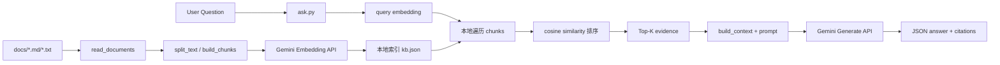
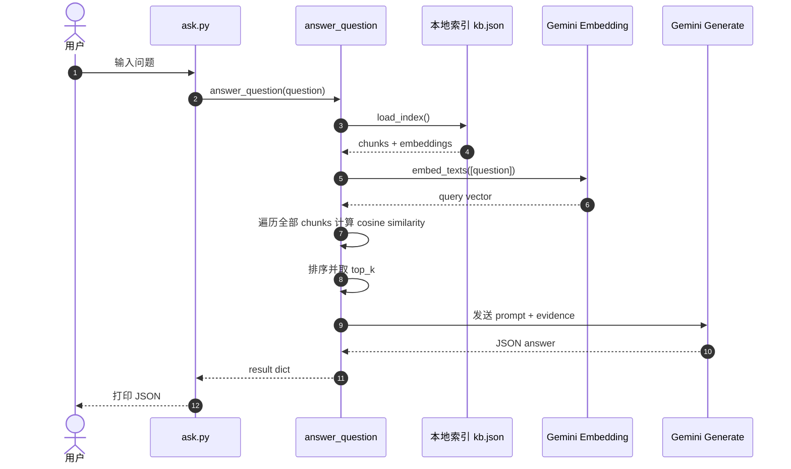

# 当前 RAG Demo 技术分享梳理

## 1. 文档目的

这份文档不是泛化的 RAG 理论介绍，而是对当前项目里已经跑通的 demo 做一次工程化梳理，方便直接拿去做技术分享。

适用场景：

- 向团队介绍这个 demo 现在已经实现了什么
- 解释从 `ingest.py` 到 `ask.py` 的完整链路
- 说明它为什么适合做 RAG 入门演示
- 明确它和生产级 RAG 方案之间的差距

---

## 2. 一句话结论

当前项目中的 RAG demo，本质上是一套“本地 JSON 索引 + Gemini Embedding + Gemini 生成模型”的最小可用链路：

1. 离线阶段把 `docs/` 下的文档切块并向量化，落到本地 `kb.json`
2. 在线问答时先把用户问题向量化
3. 在本地遍历所有 chunk，用余弦相似度做排序召回
4. 把召回证据拼成 prompt，再调用生成模型输出结构化答案

它的优点是链路清晰、代码短、容易讲清楚；它的局限是检索比较朴素、数据边界不严格、距离生产方案还有明显差距。

---

## 3. 这个 Demo 的定位

### 3.1 它是什么

- 一个单机可运行的本地 RAG demo
- 一个适合教学和技术分享的最小实现
- 一个帮助理解“入库 -> 检索 -> 生成 -> 评测”全链路的代码样例

### 3.2 它不是什么

- 不是完整的向量数据库方案
- 不是生产级高性能检索系统
- 不是多租户、带权限、可观测、可扩展的企业级知识库平台

### 3.3 为什么它适合做分享

- 没有引入 LangChain、LlamaIndex 等重框架，核心逻辑可直接看到
- Gemini API 调用是原生 `urllib` 封装，便于讲清楚底层请求
- `ingest.py`、`ask.py`、`evaluate.py` 分工明确，适合按角色讲
- 索引直接存成本地 JSON，便于打开文件解释数据结构

---

## 4. 项目中的关键文件与职责

| 文件 | 作用 |
|---|---|
| `src/ingest.py` | 读取文档、切块、调用 embedding、生成本地索引 |
| `src/rag_core.py` | RAG 核心能力：Gemini 请求、embedding、检索、生成、JSON 解析 |
| `src/ask.py` | 单次提问入口，调用 `answer_question()` 输出结果 |
| `src/evaluate.py` | 批量评测入口，对一组问题做回归验证 |
| `src/week3_ingest_runner.py` | 用预设 profile 跑不同 chunk 参数实验 |
| `data/chroma/kb.json` | 当前本地知识库索引文件 |
| `eval/qa_samples.jsonl` | 评测样本集 |

需要特别强调的一点：

`data/chroma/` 这个目录名容易让人误以为项目用了 Chroma，但当前实现其实没有使用 Chroma 向量库。索引真实存储形式是本地 JSON 文件：

- `src/rag_core.py` 里的 `get_index_path()` 直接返回 `Path(persist_dir) / f"{collection}.json"`
- `save_index()` 用 `write_text()` 落盘
- `load_index()` 用 `read_text()` 读回

也就是说，这个 demo 当前是“看起来像向量库目录，实际上是扁平 JSON 存储”。

---

## 5. 当前 Demo 的实际数据状态

截至本地当前索引版本，知识库状态如下：

- collection: `kb`
- embedding model: `gemini-embedding-001`
- 原始文档数: `36`
- chunk 数: `243`
- 单条 embedding 维度: `3072`
- 本地索引文件: `data/chroma/kb.json`
- 索引文件大小: `17,262,070` bytes，约 `16.5 MB`

当前 chunk 占比最高的文档来源包括：

- `ai学习计划大纲.md`: 28
- `RAG技术文档.md`: 27
- `ai名词释义.md`: 21
- `tool_schemas.md`: 19
- `企业知识库机器人(GAG)框架.md`: 18
- `FunctionCalling到单Agent落地-分享稿与PPT提纲-2026-03-24.md`: 16

这组数据说明了一个很重要的现状：

当前默认 `docs_dir=docs`，因此 `docs/notes/` 下的学习资料也被一起入库了。  
这意味着当前知识库并不只是 FAQ/SOP，而是“业务文档 + 学习笔记 + 分享稿”的混合语料。

这对演示是有帮助的，因为可以快速凑出一个大一点的知识库；但对问答质量来说，它会带来明显噪音。

---

## 6. 端到端链路总览

整个 demo 可以拆成两条链路：

- 离线入库链路：`ingest.py`
- 在线问答链路：`ask.py`

### 6.1 总体架构图



---

## 7. 离线入库链路分析

离线入库对应 `src/ingest.py`。

### 7.1 做了什么

1. 递归读取 `docs/` 下所有 `.md` 和 `.txt`
2. 按固定字符窗口做切块
3. 为每个 chunk 调用 embedding
4. 把向量和文本一起保存到本地索引 JSON

### 7.2 关键流程

#### 第一步：读文档

`read_documents()` 会递归扫描 `docs_dir`：

- 只保留文件
- 只收 `.md` / `.txt`
- 每篇文档保存为 `{text, source, source_file}`

这一步的特点：

- 非常直接，几乎没有清洗
- 不做 HTML、PDF、表格、图片解析
- 没有去重
- 没有元数据扩展，比如业务域、时间、权限标签

#### 第二步：切块

`split_text()` 采用固定窗口切块：

- 默认 `chunk_size=600`
- 默认 `chunk_overlap=120`
- 优先尝试在换行或标点处截断

`build_chunks()` 再给每个 chunk 补充字段：

- `source`
- `source_file`
- `chunk_id`
- `text`

当前 `chunk_id` 形如：

```text
faq#1
faq#2
faq#3
```

这个设计的优点是容易读懂；缺点是它不是稳定 ID。文档内容一旦变化，后续 chunk 的编号会整体漂移。

#### 第三步：向量化

`embed_texts()` 负责调用 Gemini embedding 接口。

特点：

- 默认模型是 `gemini-embedding-001`
- 优先走 `batchEmbedContents`
- 如果批量接口不支持，再退到单条 `embedContent`
- 对 429/5xx 做了自动重试

#### 第四步：落盘

最终索引结构大致如下：

```json
{
  "collection": "kb",
  "embedding_model": "gemini-embedding-001",
  "updated_at": "2026-03-24T09:23:02+00:00",
  "raw_docs_count": 36,
  "chunk_count": 243,
  "chunks": [
    {
      "source": "docs/faq.md",
      "source_file": "faq.md",
      "chunk_id": "faq#1",
      "text": "...",
      "embedding": [0.123, -0.456, "..."]
    }
  ]
}
```

### 7.3 这一段适合分享时怎么讲

可以直接用一句话概括：

“当前 demo 的入库没有依赖外部向量库，而是把 chunk 和 embedding 一起序列化到本地 JSON，这样最容易理解 RAG 的本质数据结构。”

---

## 8. 在线问答链路分析

在线问答入口是 `src/ask.py`，真正核心逻辑在 `src/rag_core.py` 的 `answer_question()`。

### 8.1 ask.py 的职责

`ask.py` 很薄，只做三件事：

1. 解析命令行参数
2. 调用 `answer_question()`
3. 打印 JSON 输出

也就是说，`ask.py` 是 CLI 包装层，不承载业务逻辑。

### 8.2 问答链路的关键步骤

#### 第一步：加载本地索引

`load_index()` 从 `data/chroma/kb.json` 读取已保存的 chunk 和 embedding。

#### 第二步：把用户问题向量化

`retrieve_evidence()` 首先调用 `embed_texts([question])`，把用户问题转成 query vector。

这一步需要强调：

- 在线问答时也会调用一次 embedding 模型
- 所以一次问答至少包含两类模型调用

#### 第三步：本地相似度检索

`retrieve_evidence()` 会遍历索引里的所有 chunk：

1. 用 `cosine_similarity()` 计算问题向量和 chunk 向量的相似度
2. 按分数排序
3. 取前 `top_k`

这意味着当前检索方式是：

- 本地全量遍历
- 暴力相似度排序
- 不使用 ANN
- 不使用 BM25
- 不使用 rerank

这是当前 demo 最值得讲清楚的一点：

它确实是 RAG，但它不是“向量数据库 RAG”，而是“手写的最小版向量检索 RAG”。

#### 第四步：组装上下文

`build_context()` 会把 top-k 证据拼成如下结构：

```text
- [faq.md | faq#3 | score=0.740]
文本片段...
- [refund_sop.md | refund_sop#2 | score=0.701]
文本片段...
```

这个格式便于模型：

- 看见来源文件
- 看见 chunk_id
- 看见检索分数
- 直接基于证据回答

#### 第五步：调用生成模型

`call_chat_model()` 调用 Gemini `generateContent`，并要求返回 JSON：

- 包含 `answer`
- 包含 `citations`
- 包含 `confidence`
- 包含 `need_handoff`
- 包含 `handoff_reason`

这意味着当前输出不是普通自然语言文本，而是“结构化问答结果”。

#### 第六步：解析和兜底

`extract_json()` 负责把模型返回文本解析为 JSON。

如果失败，会走 `_fallback_answer()`：

- 给一个兜底 answer
- 带上前两条 citation
- 标记 `need_handoff=true`

### 8.3 ask.py 的时序图



### 8.4 分享时建议强调的认知点

- 一次问答会调用两次模型
- 第一次是 embedding，用于检索
- 第二次是 generate，用于回答
- 检索逻辑是本地 Python 写的，不是模型替你做的

---

## 9. evaluate.py 是做什么的

`src/evaluate.py` 是当前 demo 的批量回归测试工具。

它的作用不是回答单题，而是：

1. 从 `eval/qa_samples.jsonl` 里读取多条问题
2. 对每条问题都调用一次 `answer_question()`
3. 用简单规则打分
4. 输出整体通过率

### 9.1 当前评分逻辑

每条 case 最多 2 分：

- `keyword_hit`
  要求回答里包含 `expected_keywords`
- `handoff_hit`
  要求 `need_handoff` 与预期一致

最后汇总：

- 总题数
- 总得分
- 总通过率

### 9.2 这个评测的价值

- 适合做 smoke test
- 适合比较 prompt、chunk 参数、top_k 调优前后的变化
- 适合做“这个 demo 退化没退化”的快速验证

### 9.3 它的局限

- 只做关键词匹配，语义评分很粗
- 不检查 citation 是否真的准确
- 不检查检索层 Recall@K
- 不检查回答是否有幻觉但正好命中了关键词

所以可以把它描述成：

“一个轻量回归测试工具，而不是严格的 RAG 评测平台。”

---

## 10. 当前 Demo 的技术亮点

### 10.1 优点一：链路简单，适合教学

整个实现非常薄：

- 不依赖复杂框架
- 每个文件的职责边界比较清晰
- 代码量小，容易从头讲到尾

### 10.2 优点二：索引结构可见

本地 JSON 索引非常适合展示 RAG 的真实数据结构：

- chunk 文本
- metadata
- embedding

很多人学 RAG 时停留在概念图，这个 demo 可以直接打开 `kb.json` 展示“向量化后的知识库长什么样”。

### 10.3 优点三：输出是结构化 JSON

当前回答除了 `answer`，还有：

- `citations`
- `confidence`
- `need_handoff`
- `handoff_reason`

这对客服、知识库、坐席辅助场景很重要，因为它天然支持：

- 前端展示引用
- 低置信度转人工
- 审计和追踪

### 10.4 优点四：具备最基本的稳定性处理

当前实现已经考虑了：

- `.env` 加载
- 模型 fallback
- embedding batch fallback
- 429 自动重试
- JSON 解析兜底

这让 demo 不只是“实验脚本”，而是一个有最小容错能力的样例。

---

## 11. 当前 Demo 的边界与问题

这一部分是技术分享里最有价值的地方。要让听众知道：这个 demo 能说明原理，但不能直接等同于生产方案。

### 11.1 问题一：语料边界不干净

默认 `docs_dir=docs`，导致：

- FAQ
- SOP
- 学习笔记
- 分享稿
- RAG 理论文档

会被一起入库。

风险：

- 用户问业务问题时，可能召回到学习资料
- 理论文档和 FAQ 混进一个索引，会拉高噪音

这是当前最优先的架构问题之一。

### 11.2 问题二：检索方式是全量扫描

当前 `retrieve_evidence()` 是：

- 遍历每个 chunk
- 算一次余弦相似度
- 排序取 top-k

这在 243 个 chunk 时没问题，但规模一大就会出问题：

- 延迟上涨
- CPU 成本上涨
- 无法支撑更大语料

### 11.3 问题三：没有 rerank，没有混合检索

当前只有 dense retrieval，没有：

- BM25
- hybrid search
- cross-encoder rerank

所以当前召回质量完全依赖 embedding 本身，面对术语、短问句、歧义问法时会比较脆弱。

### 11.4 问题四：索引落本地 JSON，简单但不经济

优点是好理解，缺点也很明显：

- 文件会越来越大
- 每次加载都读整份 JSON
- embedding 直接内嵌在文本里，存储冗余明显
- 不适合高并发

### 11.5 问题五：chunk 策略还比较粗

当前切块是固定窗口 + overlap：

- 容易实现
- 但不够语义化

而且 `split_text()` 里的中文标点分隔符当前存在编码污染痕迹，说明切块逻辑对中文文档的适配还不够稳定。

### 11.6 问题六：评测体系比较初级

`evaluate.py` 只能做：

- 关键词命中
- 是否该转人工

还没有：

- 检索层指标
- 引用准确率
- 事实一致性
- 人工标注闭环

### 11.7 问题七：部分兜底文案存在编码问题

当前 `rag_core.py` 的部分 fallback 文案还能看到编码异常痕迹。  
虽然主链路已经可用，但这说明项目里还存在编码一致性问题，后续最好统一做一轮清理。

---

## 12. 分享时建议怎么讲“当前方案”

建议不要把它讲成“我们已经做了一个完整 RAG 系统”，而是讲成：

“我们已经做了一个最小闭环版 RAG demo，并且把最关键的 4 件事跑通了。”

这 4 件事分别是：

1. 文档入库
2. 向量检索
3. 证据约束生成
4. 批量回归验证

这样讲的好处：

- 技术上真实
- 叙事上清晰
- 方便自然过渡到后续优化路线

---

## 13. 一套适合分享的讲述顺序

### 13.1 第一部分：先讲为什么做这个 demo

建议话术：

“我们在做一个面向客服/知识库的最小 RAG 验证，目标不是一步到位做生产平台，而是先把最核心的链路跑通，并用尽量短的代码把原理讲明白。”

### 13.2 第二部分：讲这个 demo 的最小闭环

建议按这个顺序讲：

1. `ingest.py` 把文档切块并向量化
2. `ask.py` 先做 query embedding
3. 本地按余弦相似度召回 top-k
4. 把证据交给大模型生成答案
5. `evaluate.py` 做批量回归

### 13.3 第三部分：讲这个 demo 和生产方案的差距

可以直接列：

- 现在是本地 JSON，不是真正向量库
- 现在是全量扫描，不是 ANN
- 现在没有混合检索和 rerank
- 现在评测比较粗
- 现在语料边界不够严格

这一部分会让分享显得很成熟，不会给人“把 demo 当产品”的感觉。

---

## 14. 现场演示建议

### 14.1 最小演示命令

```powershell
python src/ingest.py
python src/ask.py "工单时效有问题"
python src/evaluate.py --dataset eval/qa_samples.jsonl
```

### 14.2 更适合分享的演示顺序

建议按下面的顺序演示：

1. 先打开 `src/ingest.py`，讲“知识库是怎么做出来的”
2. 再打开 `data/chroma/kb.json`，讲“索引里面到底存了什么”
3. 然后运行 `python src/ask.py "工单时效有问题"`
4. 最后运行 `python src/evaluate.py --dataset eval/qa_samples.jsonl`

### 14.3 现场最容易被问到的问题

#### 问题 1：为什么问一次问题要调两次模型

回答思路：

- 第一次是 embedding，用于检索
- 第二次是 generate，用于基于证据生成答案

#### 问题 2：既然已经检索到了，为什么还要大模型

回答思路：

- 检索负责找证据
- 模型负责理解问题、整合多条证据、生成可读答案、输出结构化结果

#### 问题 3：为什么不用向量数据库

回答思路：

- 当前 demo 是为了把链路讲清楚，所以先用本地 JSON
- 真正扩展规模时，向量数据库或 FAISS/ANN 索引是下一步

---

## 15. 从当前 Demo 演进到下一阶段的建议

### 15.1 第一优先级

- 把语料分仓，不要再把 `docs/notes/` 和业务 FAQ 混在一个索引里
- 明确 `docs/faq.md`、`refund_sop.md`、`shipping_sop.md` 等业务语料边界
- 清理编码问题，尤其是切块分隔符和 fallback 文案

### 15.2 第二优先级

- 接入真正的向量检索引擎
- 至少支持 ANN 或本地 FAISS
- 加入 BM25 或 hybrid retrieval
- 增加 rerank

### 15.3 第三优先级

- 支持增量入库，不要每次全量重建
- 优化 metadata 设计
- 加入领域标签、来源、更新时间、权限字段

### 15.4 第四优先级

- 升级 `evaluate.py`
- 区分检索指标和生成指标
- 增加人工标注样本
- 让评测不仅看关键词，还看证据是否正确

---

## 16. 分享时可直接用的总结页

可以直接用下面这段做结尾：

> 当前这个 RAG demo 已经把最关键的链路跑通了：离线入库、在线检索、证据约束生成、批量回归验证。  
> 它的价值不在于“已经是完整产品”，而在于“已经把 RAG 最核心的工程骨架落到了代码上”。  
> 下一步的重点不是继续堆功能，而是先把语料边界、检索质量、索引形态和评测体系做扎实。

---

## 17. 一页版分享提纲

如果你只讲 10 到 15 分钟，可以按这个提纲：

1. 这个 demo 解决什么问题
2. 当前架构是什么
3. `ingest.py` 怎么生成本地知识库
4. `ask.py` 怎么完成一次问答
5. `evaluate.py` 怎么做回归
6. 当前方案的优点
7. 当前方案的边界
8. 下一步怎么演进

---

## 18. 附：一句话定义当前 Demo

如果需要给这个项目一个非常准确的技术定义，可以这样说：

**这是一个基于 Gemini API 的本地最小 RAG demo，使用固定窗口切块、本地 JSON 向量索引、余弦相似度暴力检索和结构化答案生成，适合教学验证，不适合直接作为生产级知识库方案。**
