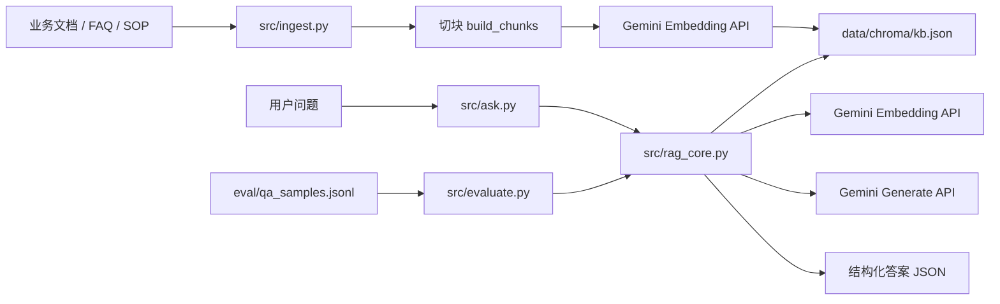
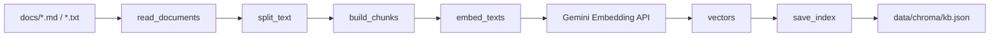
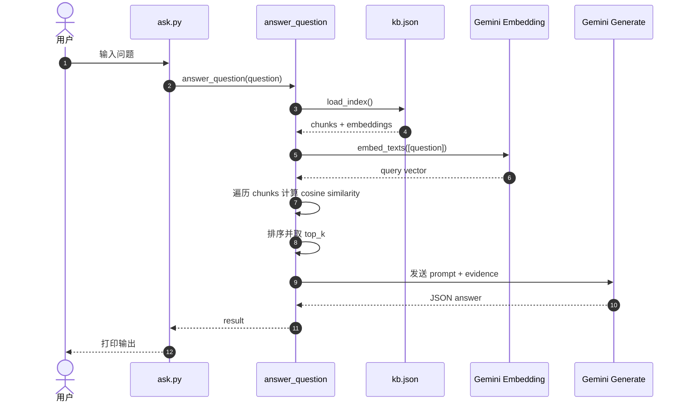
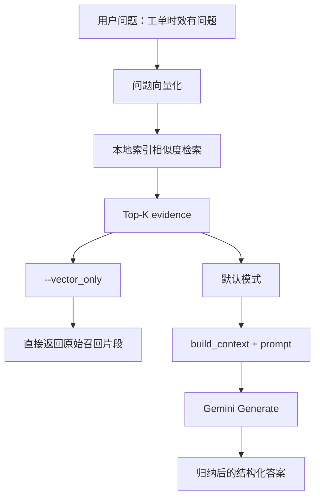
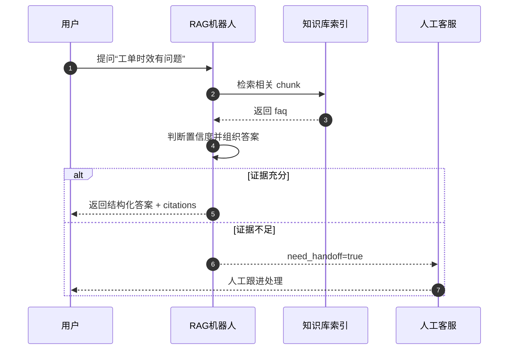

# 当前 RAG Demo 技术分享梳理

## 1. 目标

这份文档面向技术分享，聚焦当前项目里已经跑通的 RAG demo 本身，而不是泛化讲 RAG 理论。

目标有 4 个：

1. 讲清楚当前 demo 的架构设计
2. 讲清楚离线入库和在线问答的数据流向
3. 讲清楚一次“工单问题”是如何被处理的
4. 明确当前方案的优点、边界和下一步演进方向

---

## 2. 一句话定义当前 Demo

当前项目中的 RAG demo，是一套“本地 JSON 索引 + Gemini Embedding + Gemini 生成模型”的最小可用链路：

1. 离线把知识文档切块并向量化，落到本地 `kb.json`
2. 在线问答时先把用户问题转成向量
3. 在本地遍历所有 chunk，用余弦相似度做排序召回
4. 把召回证据拼成 prompt，再调用生成模型输出结构化答案

它的核心价值不在于“功能很多”，而在于“把 RAG 最关键的工程骨架落到了代码上”。

---

## 3. 当前 Demo 的定位

### 3.1 它是什么

- 一个单机可运行的最小 RAG demo
- 一个适合教学、演示和做技术分享的样例
- 一个帮助理解“入库 -> 检索 -> 生成 -> 评测”闭环的工程实现

### 3.2 它不是什么

- 不是完整的向量数据库方案
- 不是生产级高性能知识库系统
- 不是带权限、观测、增量更新、混合检索的企业级平台

---

## 4. 关键文件与职责

| 文件 | 作用 |
|---|---|
| `src/ingest.py` | 离线入库：读文档、切块、向量化、写索引 |
| `src/rag_core.py` | RAG 核心逻辑：Embedding、检索、生成、结构化输出 |
| `src/ask.py` | 单次提问入口 |
| `src/evaluate.py` | 批量评测入口 |
| `src/week3_ingest_runner.py` | 用不同切块 profile 做实验 |
| `data/chroma/kb.json` | 当前本地知识库索引 |

需要特别强调：

虽然目录名叫 `data/chroma/`，但当前 demo 并没有真正使用 Chroma 向量数据库。当前索引真实形态是本地 JSON 文件：

- `rag_core.py` 里用 `get_index_path()` 得到 `data/chroma/kb.json`
- `save_index()` 用 `write_text()` 落盘
- `load_index()` 用 `read_text()` 回读

所以这个 demo 的检索层本质上是：

**本地 JSON 索引 + 本地 Python 相似度计算**

---

## 5. 当前数据状态

当前本地索引状态如下：

- collection: `kb`
- embedding model: `gemini-embedding-001`
- 原始文档数: `36`
- chunk 数: `243`
- embedding 维度: `3072`
- 索引文件: `data/chroma/kb.json`
- 文件大小约: `16.5 MB`

这说明当前 demo 已经不是玩具级 3 到 5 条数据，而是有一定规模的可演示知识库。

但也有一个风险：

当前历史索引中曾经把学习记录一起入库，所以语料里混入了业务 FAQ、SOP、学习笔记、分享稿等不同类型内容。  
这对“能跑起来”是有帮助的，但对“回答更纯净”并不理想。

---

## 6. 架构设计

这一部分建议你分享时先讲，让大家先建立总览，再进入细节。

### 6.1 当前 Demo 的架构思路

可以把它拆成两条链：

- 离线链路：负责把文档变成可检索知识
- 在线链路：负责把用户问题变成结构化答案

核心组件如下：

- 文档源：`docs/` 下的 FAQ、SOP 等文本
- 入库脚本：`src/ingest.py`
- 索引文件：`data/chroma/kb.json`
- 问答入口：`src/ask.py`
- 核心引擎：`src/rag_core.py`
- 向量模型：Gemini Embedding
- 生成模型：Gemini Generate
- 回归评测：`src/evaluate.py`

### 6.2 图 1：系统总览架构图



这张图适合你在分享里先讲一句：

“当前 demo 不是大而全的平台，而是围绕索引、检索、生成、评测这 4 个核心动作组织起来的。”

---

## 7. 离线入库设计

离线入库对应 `src/ingest.py`。

### 7.1 入库做了什么

1. 递归读取 `docs/` 下所有 `.md` / `.txt`
2. 按固定窗口切块
3. 为每个 chunk 调用 Gemini embedding
4. 把文本、元信息、向量一起保存到 `kb.json`

### 7.2 关键实现点

- 文档读取：`read_documents()`
- 切块：`split_text()`
- 组 chunk：`build_chunks()`
- 向量化：`embed_texts()`
- 落盘：`save_index()`

### 7.3 入库的关键参数

- `chunk_size=600`
- `chunk_overlap=120`
- `embedding_model=gemini-embedding-001`
- `batch_size=64`

### 7.4 图 2：离线入库数据流图



### 7.5 讲解重点

这张图里最值得强调的是：

- 当前 demo 的“知识库”不是数据库表，而是一份本地 JSON 索引
- 每个 chunk 里既有文本，也有 embedding
- 入库阶段是一次性预处理，不是在用户提问时现切现算

---

## 8. 在线问答设计

在线问答入口是 `src/ask.py`，核心逻辑在 `src/rag_core.py` 的 `answer_question()`。

### 8.1 一次问答做了什么

1. 加载本地索引
2. 把用户问题做 embedding
3. 遍历全部 chunk 做余弦相似度计算
4. 取 top-k 证据
5. 把证据拼成 prompt
6. 调用生成模型输出结构化答案

### 8.2 当前检索方式的本质

当前 demo 的检索不是 ANN，也不是向量库内建召回，而是：

- 问题向量化
- chunk 全量扫描
- `cosine_similarity()`
- 排序
- 取 top-k

这点在分享里一定要讲清楚，因为它决定了这个 demo 的边界：

它很适合讲原理，但不适合直接拿来扩展到大规模生产场景。

### 8.3 图 3：在线问答时序图



### 8.4 讲解重点

这张图最适合用来讲两个事实：

1. 一次问答通常至少调用两次模型
2. 检索和生成是两段不同职责的链路

一句话总结就是：

**先用向量模型“找证据”，再用生成模型“写答案”。**

---

## 9. 工单场景下的数据流

分享时如果你要贴近业务，一定要把“工单问题”放进去，而不是只讲抽象 RAG。

以问题“工单时效有问题”为例，当前 demo 的处理流程可以这样讲：

1. 用户提出工单类问题
2. 系统把问题转成向量
3. 在本地索引中找到最相关 chunk
4. 命中 `faq.md | faq#2`
5. 如果走正常模式，再由大模型把证据归纳为更适合展示的答案

### 9.1 图 4：有模型 vs 无模型 对比图



这张图最重要的讲法是：

- 两种模式的检索结果相同
- 差异出在“是否做生成与信息压缩”

也就是说：

**无模型模式回答的是“找到了哪些材料”，有模型模式回答的是“基于这些材料，给你一个能直接用的答案”。**

### 9.2 图 5：工单业务泳道图



这张图的价值是把技术能力和业务动作对齐：

- 机器人并不一定“必须答”
- 当证据不足时，可以走 `need_handoff`
- 这正是当前 demo 输出里保留 `confidence` 和 `need_handoff` 的原因

---

## 10. 为什么需要有模型和无模型两种模式

当前 demo 已经支持：

```powershell
python src/ask.py "工单时效有问题"
python src/ask.py "工单时效有问题" --vector_only
```

### 10.1 无模型模式的价值

- 只看检索，不看生成
- 更容易解释“RAG 的检索层到底做了什么”
- 更适合排查召回是否正确

### 10.2 有模型模式的价值

- 更适合最终展示给用户
- 能做摘要、压缩、归纳
- 能把原始证据变成可读答案

### 10.3 分享时可以直接讲的结论

**向量检索解决的是“找到什么”，大模型生成解决的是“怎么回答”。**

---

## 11. evaluate.py 的作用

`src/evaluate.py` 是当前 demo 的批量回归工具。

它的作用不是回答单题，而是：

1. 从 `eval/qa_samples.jsonl` 里读取多条问题
2. 对每条问题都调用 `answer_question()`
3. 用关键词命中和 handoff 命中做简单打分
4. 输出整体通过率

这一点在分享时可以作为“这个 demo 不是只能演示，还能回归验证”的证据。

---

## 12. 当前方案的优点

### 12.1 链路清晰

- 文件职责很清楚
- 入库和问答分离
- 适合从头讲到尾

### 12.2 数据结构可见

- 可以直接打开 `kb.json`
- 每个 chunk、embedding、citation 都是看得见的

### 12.3 适合教学和分享

- 没有重框架遮蔽底层逻辑
- 每一步都能和代码一一对应

### 12.4 已经具备最小容错

- 支持 `.env`
- 支持模型 fallback
- 支持 429 自动重试
- 支持 JSON 解析兜底

---

## 13. 当前方案的边界

### 13.1 索引还不是向量数据库

当前只是本地 JSON 索引，不适合大规模、高并发场景。

### 13.2 检索还是全量扫描

当前是遍历全部 chunk 做余弦相似度排序，不是 ANN，不是 FAISS，不是 Chroma 检索。

### 13.3 没有 hybrid retrieval

当前只有 dense retrieval，没有：

- BM25
- hybrid search
- rerank

### 13.4 语料边界需要继续收敛

学习资料、分享稿、业务 FAQ 混入一个索引会带来噪音。

### 13.5 评测还比较轻

`evaluate.py` 更像 smoke test，而不是完整评测平台。

---

## 14. 面向工单场景，最该画哪些图

如果你的分享时间只有 10 到 15 分钟，建议至少画这 5 张：

1. 系统总览架构图
2. 离线入库数据流图
3. 在线问答时序图
4. 有模型 vs 无模型对比图
5. 工单业务泳道图

这 5 张图分别对应：

- 组件视角
- 数据视角
- 交互视角
- 对比视角
- 业务视角

组合起来刚好能把这个 demo 讲完整。

---

## 15. 分享建议顺序

推荐按下面顺序讲：

1. 这个 demo 要解决什么问题
2. 当前整体架构是什么
3. 离线入库怎么做
4. 在线问答怎么做
5. 工单问题是怎么被处理的
6. 为什么需要“有模型”和“无模型”两种对比
7. 当前方案的优点和边界
8. 下一步怎么演进

---

## 16. 一页总结

可以直接用下面这段做结尾：

> 当前这个 RAG demo 已经把最关键的闭环跑通了：文档入库、向量检索、证据约束生成、批量回归验证。  
> 它的价值不在于“已经是完整产品”，而在于“已经把 RAG 最核心的工程骨架落到了代码上”。  
> 对于分享来说，最值得讲清楚的不是功能数量，而是 5 张图背后的设计逻辑：系统怎么搭、数据怎么流、工单怎么处理、为什么需要大模型、以及当前方案的边界在哪里。


自己的思考

1.rag是什么,有什么作用

2.rag标准项目应用

3.向量基础,向量数据库顺带讲解

4.本地demo对照

5.ikb项目 rag逻辑梳理

5.rag demo 和ikb对账 差异对比

6.demo项目中如何分片的,ikb中如何分片的

7.以后的拓展点,逐步往工程化扩展

8.本地相似度计算和真实向量检索的差异

9.topK是什么意思,对应到transform中的什么

10.RAG先检索答案,那模型在其中起什么作用,只是RAG输出标准答案不就可以吗

11.RAG也是向量化,计算相关性,和大模型一样,如果RAG成本也很高的话,那不如直接本地部署训练大模型

12.什么情况用rag,什么情况需要再调用一次模型,在业务中的实际应用,rag可不可以微调,如何微调,在有些场景需要精确的回答
