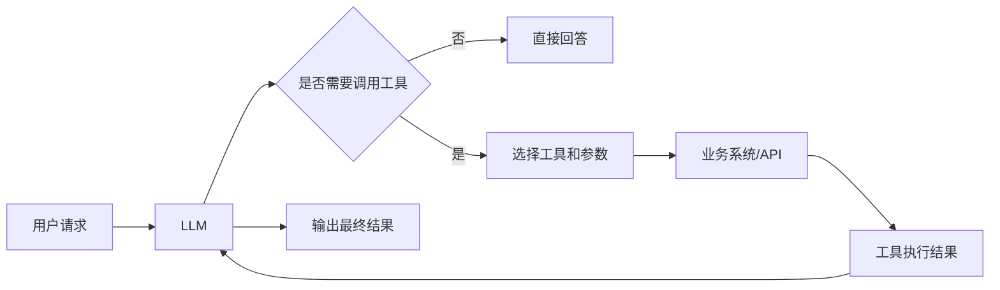

# Function Calling 到单 Agent 落地

副标题：为什么 AI 要从“聊天”变成“调接口”

更新时间：2026-03-24

## 这个方向为什么适合分享

如果直接讲“Agent 工程化”，范围还是偏大，容易讲成概念堆砌。

更适合组内分享的讲法是把范围收窄：

**不讲多 Agent，不讲大而全的框架，只讲 Function Calling 和单 Agent 是怎么把 AI 从“只会说”变成“会做事”的。**

这个方向适合当前分享，原因有 4 个：

1. 和 Java 团队最贴近，本质上就是模型如何调用现有服务和接口。
2. 非 AI 同学也能听懂，因为它不是讲训练，而是讲系统集成。
3. 话题足够具体，不容易空。
4. 听完以后，大家能马上理解 Agent 的真正价值和边界。

## 建议标题

正式分享建议用这个标题：

**Agent 工程化的起点：从 Function Calling 到单 Agent 落地**

如果你想更直白一点，也可以用这个：

**Function Calling 到底解决了什么：为什么 AI 要从聊天变成调接口**

## 适合时长

- 主讲 30 到 35 分钟
- 预留 5 到 10 分钟问答

不建议讲满 1 小时。

这个题目讲得太长，容易开始发散到：

- MCP
- 多 Agent
- Workflow 编排
- 评测
- 安全治理

这些都值得讲，但不适合混在这一次里。

## 这次分享希望大家带走什么

听完之后，组员最好能带走下面 4 件事：

1. 知道为什么纯聊天能力很快会到上限。
2. 知道 Function Calling 才是 AI 接入业务系统的关键一步。
3. 知道单 Agent 和普通 ChatBot 的差别。
4. 知道什么时候该用 Agent，什么时候其实根本不该用。

## 先讲结论

这次分享最重要的一句话可以先摆出来：

**Agent 的核心不是“像人一样思考”，而是“在约束下正确调用工具，完成任务”。**

如果没有工具调用，很多所谓 Agent 其实只是会说话的聊天机器人。

---

## 推荐分享结构

- 第 1 部分：为什么聊天式 AI 很快会遇到上限，5 分钟
- 第 2 部分：Function Calling 是什么，8 分钟
- 第 3 部分：从 Function Calling 到单 Agent，10 分钟
- 第 4 部分：工程上最容易踩的坑，8 分钟
- 第 5 部分：什么时候该用，什么时候别用，5 分钟

---

## PPT 逐页提纲与讲稿

## 第 1 页：标题页

标题：

**Agent 工程化的起点：从 Function Calling 到单 Agent 落地**

副标题：

为什么 AI 要从“聊天”变成“调接口”

你可以这样开场：

“今天不讲大模型训练，也不讲多 Agent 架构。我只讲一个最关键的问题：为什么 AI 应用不能停留在聊天，而要进一步走向调用接口、执行操作。把这个问题理解清楚，其实就理解了 Agent 工程化的起点。”

---

## 第 2 页：先看一个最常见误区

页面内容建议：

- ChatBot 不等于 Agent
- 会回答问题，不等于会完成任务
- 纯 Prompt 很快会遇到能力边界

你可以这样讲：

“很多人第一次接触大模型，会觉得它已经很聪明了，好像什么都能做。但如果你认真看，它很多时候只是把话说得像那么回事。真正的业务系统不是让 AI 说得漂亮，而是让它查订单、查库存、创建工单、发通知、生成结构化结果。也就是说，从业务角度看，真正重要的不是回答，而是执行。”

一句话落点：

**聊天解决的是表达问题，业务落地解决的是执行问题。**

---

## 第 3 页：为什么纯聊天能力很快会到上限

页面内容建议：

- 不能访问实时数据
- 不能调用内部系统
- 不能可靠地产生结构化结果
- 不能真正触发业务动作

你可以这样讲：

“如果没有工具调用，模型面对很多问题其实只能猜。比如你问‘订单 123456 为什么没发货’，如果模型访问不到订单系统，它只能泛泛解释几个可能原因。再比如你说‘帮我创建一个售后工单’，如果它不能调用工单接口，它就只能回复一句‘建议你联系售后’。所以聊天能力的上限，本质上取决于它能不能接上真实系统能力。”

可以补一句：

“这也是为什么企业里最有价值的 AI 应用，往往不是最会聊天的，而是最会接系统的。”

---

## 第 4 页：Function Calling 是什么

页面内容建议：

```text
模型不直接返回一段自然语言
而是先决定：我要调用哪个工具，传什么参数
工具执行后，再把结果交给模型继续处理
```

你可以这样讲：

“Function Calling 可以简单理解成，模型先不急着说话，而是先决定要不要调用某个工具。如果要调，它会按约定好的参数格式发起调用。比如查订单、查库存、计算运费、创建工单，本质上都是工具。工具执行完，把结果返回给模型，模型再基于这些结果继续给出最终回答。”

一句话解释：

**Function Calling 是让模型从‘文本生成器’变成‘系统能力调度者’。**

---

## 第 5 页：举一个具体例子

页面内容建议：

用户输入：

“帮我查一下订单 123456 为什么还没发货，如果库存不足就创建一个工单。”

系统可能调用的工具：

- `getOrderStatus(orderId)`
- `getInventory(skuId)`
- `createTicket(type, content)`

你可以这样讲：

“这句话如果是普通 ChatBot，它最多只能解释‘未发货的常见原因’。但如果接了 Function Calling，它就会先查订单，再决定要不要查库存，如果发现库存不足，再去创建工单。到这里，AI 才开始从‘对话系统’变成‘任务系统’。”

这页的核心不是炫酷，而是让大家建立一个感觉：

**Agent 的价值不是更能聊，而是能把已有系统能力串起来。**

---

## 第 6 页：从 Function Calling 到单 Agent

页面内容建议：

- ChatBot：只回答
- Tool-enabled AI：会调用工具
- 单 Agent：会围绕目标决定调用顺序和步骤

你可以这样讲：

“Function Calling 解决的是‘会不会调工具’。单 Agent 更进一步，解决的是‘为了完成目标，工具该怎么组合使用’。比如用户说‘帮我处理这个售后问题’，单 Agent 可能先查订单，再查物流，再查退款规则，最后决定是创建工单还是直接给出建议。也就是说，单 Agent 的重点不是工具本身，而是围绕任务目标做步骤决策。”

这里可以顺手下一个定义：

**单 Agent = 大模型 + 工具集 + 任务目标 + 决策循环**

---

## 第 7 页：Agent 和 Workflow 有什么区别

页面内容建议：

- Workflow：流程提前写死
- Agent：步骤由模型根据目标和上下文动态决定

你可以这样讲：

“这两个词经常被混着用，但其实区别很重要。Workflow 更像你写好的流程编排，先 A 再 B 再 C，确定性强。Agent 是模型根据当前任务和上下文决定下一步该干什么，它更灵活，但也更不稳定。很多场景其实根本不需要 Agent，固定流程就够了。不要为了显得高级，明明是工作流问题，非要包装成 Agent。”

一句话总结：

**流程确定，用 Workflow；路径不确定、需要动态决策时，再考虑 Agent。**

---

## 第 8 页：单 Agent 真正落地会踩哪些坑

页面内容建议：

1. 工具描述写得太模糊
2. 参数不够严格
3. 工具权限没有边界
4. 异常和重试没有处理
5. 把高风险动作直接交给模型执行

你可以这样讲：

“很多 Agent 不稳定，不是模型太笨，而是工具层设计得太随意。比如工具描述模糊，模型根本不知道什么时候该调它；参数约束不严，模型传出来的数据格式不稳定；权限控制没有做好，模型可能调用不该调用的接口；异常和超时不处理，链路一断就崩；最危险的是让模型直接执行高风险操作，比如删数据、审批通过、发正式通知，这些都必须有额外保护。”

这页可以把语气落得更工程化一点：

“一旦 AI 能调工具，它就不再只是聊天框，而是带执行能力的软件入口。”

---

## 第 9 页：什么时候该用 Agent，什么时候别用

页面内容建议：

适合：

- 任务目标明确，但步骤不完全固定
- 需要调用多个工具
- 需要根据中间结果动态决策

不适合：

- 固定流程很清晰
- 风险高且必须完全可控
- 一步 SQL / 一次 API 就能解决

你可以这样讲：

“判断要不要上 Agent，可以问三个问题。第一，这个任务是不是有多个步骤，而且步骤顺序不完全固定。第二，它是不是需要调用多个工具。第三，它是不是需要根据中间结果继续决策。如果这三个问题答案大多是‘否’，那大概率不需要 Agent。很多时候，一个结构化输出加一个普通工作流就够了。”

这页最好帮大家建立一个务实判断：

**不是所有 AI 应用都应该做成 Agent。**

---

## 第 10 页：Java 团队怎么落地

页面内容建议：

- 把已有服务封装成清晰的工具
- 先做单 Agent，不急着多 Agent
- 强约束参数和返回结构
- 给高风险工具加人工确认
- 做日志、Trace、回放

你可以这样讲：

“对 Java 团队来说，最现实的落地方式不是重新发明一套 AI 架构，而是把现有服务能力整理成边界清晰的工具，比如查询订单、查询库存、查规则、创建工单。先做单 Agent，把调用链路跑通，再补日志、Trace、重试、人工确认这些工程能力。等这些基础打稳了，再谈复杂编排。”

如果你想提一下技术栈，可以一句话带过：

“Spring AI 和 LangChain4j 都可以做这件事，重点不在框架，而在工具定义和执行边界。”

---

## 第 11 页：最后总结

页面内容建议：

- Function Calling 是 AI 落地的关键一步
- Agent 的核心是工具调用和任务完成
- 单 Agent 先跑通，比一开始做多 Agent 更实际
- 不该用 Agent 的场景，不要硬上

你可以这样收尾：

“今天如果只记住一句话，我希望是这句：Agent 的本质，不是让模型更像人，而是让模型在约束下正确调用系统能力，完成任务。对工程团队来说，真正重要的不是讲多少前沿概念，而是先把 Function Calling 和单 Agent 这一步做扎实。”

---

## 一张可以放进 PPT 的结构图



这张图只需要讲清一个点：

**模型不是直接输出答案，而是可能先走一轮“选工具 -> 调工具 -> 读结果 -> 再回答”。**

---

## 你可以直接复用的开场白

“很多人第一次看 AI 应用，关注的是它会不会聊天。但企业场景真正有价值的问题通常不是‘它能不能回答’，而是‘它能不能查系统、调接口、完成任务’。今天我想讲的就是这一步：为什么 AI 要从聊天走向 Function Calling，再走向单 Agent 落地。”

## 你可以直接复用的结束语

“如果没有工具调用，很多 AI 只是会说话；有了 Function Calling，它才开始接上真实业务能力；能围绕目标动态使用这些工具，它才开始接近 Agent。对工程团队来说，先把这一层理解透，比一上来追多 Agent 或更大的概念更重要。”

---

## 听众可能会问的问题

### 问题 1：Function Calling 和普通 API 调用有什么区别

回答建议：

“普通 API 调用是程序员提前写死调用逻辑，Function Calling 是把‘选哪个接口、传什么参数’这部分决策交给模型，但仍然在受控边界内执行。”

### 问题 2：是不是接了工具就叫 Agent

回答建议：

“不完全是。接了工具只是具备了工具调用能力。Agent 更强调围绕目标动态决定步骤，而不只是单次调用。”

### 问题 3：为什么不建议一开始做多 Agent

回答建议：

“因为复杂度会上升得很快，调试、评测、回放、权限控制都会更难。大多数团队先把单 Agent 做稳，收益更高。”

### 问题 4：哪些场景其实不该用 Agent

回答建议：

“流程确定、风险高、一步就能完成的场景，通常不需要 Agent。比如固定表单处理、明确规则判断、可预定义的审批流。”

---

## 极简版 25 分钟讲法

如果时间更短，可以只讲这 6 页：

1. 为什么纯聊天会到上限
2. Function Calling 是什么
3. 一个业务例子
4. 从 Function Calling 到单 Agent
5. 最常见的坑
6. 什么时候该用，什么时候别用

这样更紧凑，也最适合第一次讲这个方向。

---

## 参考资料

- OpenAI: A practical guide to building agents  
  https://openai.com/business/guides-and-resources/a-practical-guide-to-building-ai-agents/
- Anthropic: Building effective agents  
  https://www.anthropic.com/engineering/building-effective-agents
- Spring AI Reference  
  https://docs.spring.io/spring-ai/reference/
- Spring AI MCP Overview  
  https://docs.spring.io/spring-ai/reference/api/mcp/mcp-overview.html
- LangChain4j AI Services  
  https://docs.langchain4j.dev/tutorials/ai-services/
- LangChain4j Tools  
  https://docs.langchain4j.dev/tutorials/tools/

## 最终建议

如果你最终决定讲 Agent 方向，建议不要直接讲“Agent 工程化全景”，而是用这次这个版本：

**从 Function Calling 到单 Agent 落地**

这个题目更具体，也更容易让组员真正听明白。
