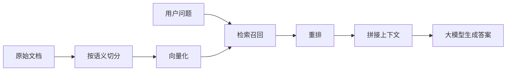

# 为什么 RAG 经常答非所问

副标题：从文档切分、检索到重排，讲清 AI 知识库到底是怎么工作的

更新时间：2026-03-24

## 分享定位

适合时长：

- 主讲 30 到 40 分钟
- 预留 5 到 10 分钟问答

适合听众：

- 后端开发
- 测试
- 产品
- 对 AI 感兴趣但不是 AI 从业者的同学

分享目标：

1. 让大家知道 RAG 不是“接个向量库”这么简单。
2. 让大家理解为什么知识库问答会答错。
3. 让大家听完后知道排查思路，而不是只会说“模型不行”。

一句话主结论：

**很多 RAG 效果差，不是模型不够强，而是文档切分、检索召回、重排和上下文拼装没做好。**

---

## 推荐时长分配

- 第 1 部分：现象和问题，5 分钟
- 第 2 部分：RAG 最小工作原理，8 分钟
- 第 3 部分：最常见的 5 个坑，15 分钟
- 第 4 部分：工程上怎么改，8 分钟
- 第 5 部分：总结和问答，5 到 10 分钟

---

## PPT 逐页提纲与讲稿

## 第 1 页：标题页

标题：

**为什么 RAG 经常答非所问**

副标题：

从文档切分、检索到重排，讲清 AI 知识库到底是怎么工作的

建议停留时间：

- 1 分钟

你可以这样开场：

“今天不讲大模型训练，也不讲 Transformer。只讲一个大家最容易遇到的问题：为什么 AI 明明接了知识库，还是经常答非所问。这个问题如果讲清楚，大家以后看很多 AI 产品，就不会只停留在‘它好像不太聪明’这个层面，而会知道问题到底可能出在哪个环节。”

---

## 第 2 页：先看现象

页面内容建议：

- 文档明明在库里，AI 还是答错
- 回答看起来很像对的，但细节不对
- 不同问法，答案忽好忽坏
- 一加知识库，效果不一定更好

建议停留时间：

- 3 分钟

你可以这样讲：

“很多人对 RAG 的理解是，把公司的 PDF、Word、FAQ 丢进去，再接一个大模型，知识库就做完了。结果上线后发现一个很典型的问题：文档明明在，AI 还是答不出来，或者答得似是而非。这里最容易产生一个误区，就是把所有问题都怪到模型头上。其实很多时候，模型只是在用你给它的材料做回答，材料给错了、给少了、给乱了，它当然就会答偏。”

可以举一个具体例子：

“比如公司报销制度明明写了‘超过 3000 元需要部门负责人审批，超过 10000 元需要总监审批’，用户问‘8000 元报销要不要总监批’，AI 却回答‘需要总监审批’。这时候问题不一定在模型理解能力，而可能在检索阶段把相关段落切坏了，或者根本没召回正确内容。”

---

## 第 3 页：先把 RAG 说清楚

页面内容建议：

```text
用户提问
  -> 检索相关文档片段
  -> 把片段塞进上下文
  -> 让大模型基于这些内容回答
```

建议停留时间：

- 4 分钟

你可以这样讲：

“RAG 这个词可以先别记全称，你先记住它做的事情：不是让模型凭空回答，而是先去找资料，再基于资料回答。它像一次开卷考试。关键问题不只是模型会不会答，而是你有没有把正确的资料，在合适的长度内，按合适的方式喂给它。”

一句话解释 RAG：

**RAG = 检索 + 上下文增强 + 生成答案**

这里顺手强调：

- 它不是训练模型
- 它更像给模型临时开卷
- 它非常依赖前面的检索质量

---

## 第 4 页：RAG 的最小链路

页面内容建议：

1. 原始文档
2. 文档切分
3. 向量化
4. 检索召回
5. 重排
6. 拼接上下文
7. 大模型生成答案

建议停留时间：

- 4 分钟

你可以这样讲：

“如果把 RAG 拆开看，它其实是一条流水线。原始文档先切成一个个片段，再把片段转换成向量，用户提问后系统去找最相关的几个片段，必要时再做一次重排，然后把这些片段连同用户问题一起发给大模型生成答案。也就是说，最后那个‘回答’只是流水线最后一步，前面任何一步有问题，答案都会偏。”

可以顺手做一个比喻：

“这很像程序里的查询链路。你最终查到的数据不对，不一定是渲染层的锅，也可能是索引、过滤条件、排序规则或者数据预处理有问题。”

---

## 第 5 页：坑 1 和坑 2，文档切分不合理

页面内容建议：

- Chunk 太大：主题混杂，召回不准
- Chunk 太碎：上下文断裂，语义残缺
- 机械按字数切分，最容易出问题

建议停留时间：

- 5 分钟

你可以这样讲：

“很多知识库效果差，第一刀就死在切分上。切得太大，一个 chunk 里塞了审批规则、报销范围、附件要求三种内容，用户问其中一个点，系统可能召回一个大杂烩片段。切得太碎也不行，比如把‘超过 10000 元需总监审批’这一句和前面的适用条件拆开了，模型看到的只是半句话，理解自然会出偏差。”

可以强调一个很容易记住的原则：

**切分不是为了凑 token，而是为了保留语义单元。**

适合放一个对比例子：

- 错误切分：每 500 字硬切一次
- 更好切分：按标题、小节、问答对、规则条款切

---

## 第 6 页：坑 3，检索到了“像的”，不等于检索到了“对的”

页面内容建议：

- 相似度检索不等于精确命中
- 关键词相近，业务含义可能不同
- topK 太大，容易把噪音一起带进去

建议停留时间：

- 4 分钟

你可以这样讲：

“向量检索擅长找语义相近的内容，但‘相近’不代表‘正确’。比如用户问‘报销是否需要总监审批’，系统可能检索到一堆带有‘审批’、‘金额’、‘负责人’的片段，但其中真正决定答案的那一句，未必排在最前面。还有一个常见误区是觉得 topK 越大越保险，实际上你给模型塞进去的材料越多，噪音也越多，反而可能把关键信息淹掉。”

一句话总结：

**召回是尽量别漏，重排是尽量别错。**

---

## 第 7 页：坑 4 和坑 5，上下文污染与无来源回答

页面内容建议：

- 召回内容太多，模型注意力被稀释
- 互相矛盾的片段同时出现
- 回答不附来源，用户无法判断可信度

建议停留时间：

- 4 分钟

你可以这样讲：

“就算检索大体方向对了，也不代表结果一定好。如果你把 10 段、20 段内容一股脑塞进去，其中几段还是旧版本规则，模型可能会做出错误综合。还有一个现实问题是，很多系统回答完不给来源。用户看到一句看上去挺专业的话，但完全不知道它是来自制度原文，还是模型自己补出来的。对企业场景来说，这非常危险。”

可以顺手强调：

- 能附来源，可信度会高很多
- 能看到引用片段，排错效率也会高很多

---

## 第 8 页：工程上怎么改

页面内容建议：

- 按语义切分，不机械切
- 给 chunk 加 metadata
- topK 要调，不是越大越好
- 关键场景加重排
- 回答附引用来源
- 新旧文档要治理

建议停留时间：

- 6 分钟

你可以这样讲：

“到这里大家会发现，RAG 并不是一个神秘的 AI 黑盒，它其实很工程化。第一，切分要按语义来做，标题、章节、问答、条款都是天然切分点。第二，要给文档加 metadata，比如文档类型、版本、部门、时间、主题，这样后面检索和过滤才有抓手。第三，topK 要调，不能拍脑袋。第四，关键业务可以加重排，让最相关的片段排在前面。第五，回答尽量带引用，至少让用户知道答案是基于哪几段文档得出的。第六，文档治理比很多人想的更重要，旧制度、新制度同时存在时，系统很容易把两者混在一起。”

这里可以加一句很接地气的话：

“别急着换更强的模型，先把检索链路收拾干净，很多问题会先消掉一半。”

---

## 第 9 页：用一个完整例子串起来

页面内容建议：

例子：

用户问题：

“8000 元报销需要总监审批吗？”

知识库原文：

- 5000 元以下，无需部门负责人审批
- 5000 元到 10000 元，需要部门负责人审批
- 10000 元以上，需要总监审批

错误原因可能有：

- 切分把金额区间拆散
- 只召回了“需要审批”，没召回“10000 元以上”
- 旧制度和新制度同时被召回

建议停留时间：

- 4 分钟

你可以这样讲：

“我们把前面的内容全串起来。这个问题本身不复杂，但如果切分不合理，‘5000 到 10000 元’和‘10000 元以上’被拆开；如果检索不准，只抓到了‘审批’相关片段；如果系统里还有旧制度版本一起进来，最后模型就有很大概率答错。也就是说，看上去是一个‘模型判断错误’，其实它更像是一个‘资料供给链错误’。”

这页的目标不是炫技术，而是让大家真正建立链路视角。

---

## 第 10 页：最后总结

页面内容建议：

- RAG 不是“文档一丢就能用”
- 知识库效果差，优先看检索链路
- 先解决数据和检索问题，再怀疑模型
- 附来源、可排错，比“看起来聪明”更重要

建议停留时间：

- 2 分钟

你可以这样收尾：

“今天我最想让大家带走的一件事是：RAG 的问题，很多不是出在模型最后那一下生成，而是出在前面的文档处理和检索链路。以后大家再看一个知识库系统，如果它经常答非所问，不要只说模型不聪明，要先问一句：它到底有没有拿到正确材料。”

最后一句可以直接落成：

**AI 知识库做得好不好，本质上是一个信息检索和工程治理问题，不只是模型问题。**

---

## 一页图示建议

如果你想在 PPT 里放一张图，建议用这张：



这张图的作用不是讲技术细节，而是让大家知道：

**答案只是最后一步，前面是一整条链路。**

---

## 你可以直接复用的开场白

“今天我不打算讲大模型原理，也不打算讲很前沿的概念。我只讲一个大家以后几乎一定会遇到的问题：为什么 AI 接了知识库，还是经常答错。这个问题如果理解清楚，大家对很多 AI 应用的判断会立刻提升一个层次。”

## 你可以直接复用的结束语

“如果把今天的内容压缩成一句话，就是：RAG 不是把文档丢给模型，而是先把文档加工成模型能正确使用的上下文。知识库效果不好，先查切分、检索、重排和文档治理，不要第一反应就是模型不够强。”

---

## 听众可能会问的问题

### 问题 1：RAG 和微调是什么关系

回答建议：

“RAG 是把外部知识临时拿给模型看，微调是把某些能力或风格训练进模型。企业知识库场景里，通常先做 RAG，而不是先做微调。”

### 问题 2：是不是模型越强，RAG 效果就越好

回答建议：

“模型强会有帮助，但不是决定性因素。如果检索链路给错材料，再强的模型也可能一本正经答错。”

### 问题 3：topK 应该设多少

回答建议：

“没有统一答案，要结合业务和文档特点做测试。核心原则不是越大越好，而是够用且少噪音。”

### 问题 4：为什么一定要附来源

回答建议：

“因为知识库场景最重要的不只是回答出来，而是回答可验证。附来源既能提升用户信任，也方便排错。”

---

## 如果你想做成 30 分钟极简版

可以只保留这 6 页：

1. 为什么知识库会答错
2. RAG 的最小原理
3. 文档切分为什么重要
4. 检索和重排为什么重要
5. 工程上怎么改
6. 最后总结

这样会更紧凑，也更适合第一次分享。

---

## 可选补充页

如果你担心现场有人会问“Java 怎么做”，可以额外准备一页，不一定正式讲：

- Spring AI
- LangChain4j
- 向量库
- 文档解析
- Rerank
- Trace / Eval

这页不要展开，只作为问答兜底。

---

## 最终建议

这次分享不要追求覆盖面，追求一件事：

**让听众以后看到 AI 知识库答错时，知道该从哪几个环节去理解和排查。**

如果达到这一点，这次分享就已经很值了。
