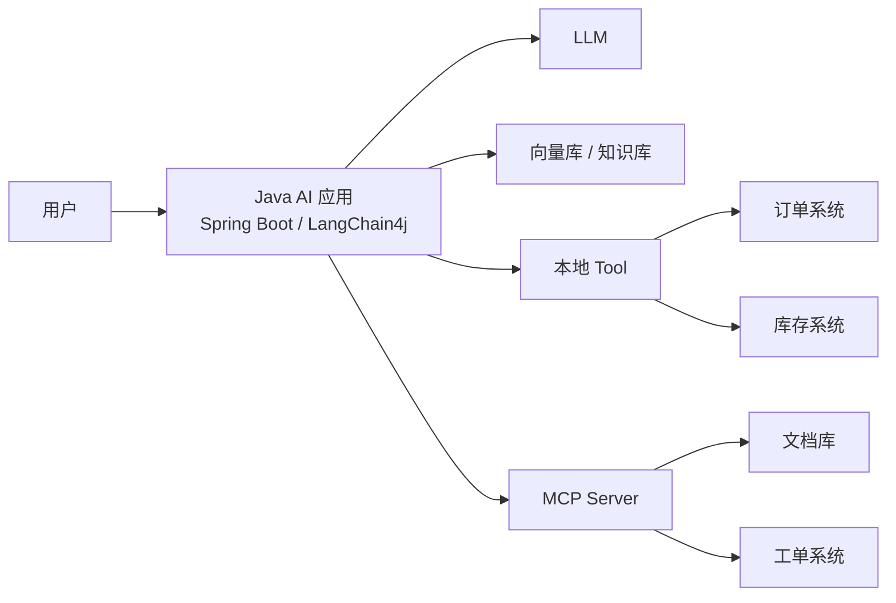

# Java 程序员的 AI 学习路线与组内分享建议

更新时间：2026-03-20

## 先给结论

如果你只准备在组内分享一个 1 小时主题，我建议讲：

**AI Agent 工程化：从 Tool Calling 到 MCP，Java 如何落地企业级智能应用**

这个题目比 `Transformer` 和“模型微调”更贴近当前工程实践，原因很直接：

1. 它避开了已经有人分享过的模型原理和训练路线。
2. 现在 AI 落地的重点，越来越从“怎么训练模型”，转向“怎么把模型接到企业数据、系统和流程里”。
3. 这类事情和 Java 程序员最擅长的能力高度重合：系统集成、服务治理、权限控制、可观测性、稳定性、工程化。

## 现在 AI 领域，Java 程序员优先该学什么

如果你不是要去做底层大模型训练，而是希望在当前行业里具备 AI 落地能力，建议按下面顺序学习。

### 1. LLM 应用基础

先把几个核心概念学扎实：

- Token、上下文窗口、系统提示词、结构化输出
- Prompt 设计的基本方法
- Tool Calling / Function Calling
- 模型选择：大模型、小模型、推理模型、成本和延迟权衡

这是所有后续内容的地基。很多团队的问题不是“模型不够强”，而是输入输出契约没设计好。

### 2. RAG 与知识库工程

这部分不是微调，而是“让模型用到你的私有知识”：

- Embedding
- 向量数据库
- Chunk 切分
- 检索召回
- 重排
- 引用与可追溯
- 知识库更新与治理

对企业内场景来说，RAG 仍然是最实用的基础设施之一。

### 3. Agent 工程化

这是 2025-2026 最值得关注的应用方向之一：

- 什么是 Agent，什么不是 Agent
- 单 Agent 与多 Agent
- Workflow 编排
- Tool 调用
- 任务分解
- 状态管理
- Guardrails

一句话概括：模型不只是“回答问题”，而是“调用工具、读取数据、执行流程、交付结果”。

### 4. MCP（Model Context Protocol）

MCP 可以理解为 AI 世界里连接工具和数据源的标准接口层：

- 为什么过去的 AI 集成是 N x M 问题
- MCP 的 Host / Client / Server 结构
- 如何把数据库、文件、内部系统、业务 API 暴露给 AI
- 为什么它对企业集成很重要

这部分尤其适合 Java 团队，因为 Java 团队本来就长期在做系统接口标准化和服务封装。

### 5. Evals、Tracing 与可观测性

传统软件测试不够覆盖 AI 系统，原因是 AI 输出具有概率性。要补上的能力包括：

- 用例集构建
- 自动化评测
- 人工评审
- Trace 追踪
- Prompt / Tool / Model 级别问题定位
- 幻觉、误调用、越权调用的发现

这一块非常值得学，因为“能跑”不等于“能上线”。

### 6. 多模态能力

企业实际场景已经不只是文本：

- 图片理解
- PDF / 表格 / 文档解析
- 音频转写
- 语音交互
- 图文混合理解

很多业务价值就藏在“非结构化文档”和“图片 + 文本”的组合里。

### 7. 成本、性能与部署

真正上线时，必须考虑：

- 模型延迟
- Token 成本
- 缓存
- 限流
- 回退策略
- 本地模型 / 私有化模型的适用边界
- 线上 SLA

工程团队最后比拼的，往往不是 Demo 能力，而是单位成本下的稳定交付能力。

### 8. 安全、权限与治理

越进入企业，越绕不开：

- Prompt Injection
- 数据泄漏
- 工具越权
- 审计日志
- 结果可追责
- 敏感数据脱敏
- 人机协同审批

AI 应用不是普通聊天框，接了工具以后就变成了“带执行能力的软件”。

### 9. 微调、蒸馏、训练数据工程

这当然仍然重要，但对大多数 Java 工程师来说，不建议把它当第一优先级。

更现实的学习顺序通常是：

**先会做 AI 应用，再决定是否需要做微调。**

## 值得分享的主题

下面这些都适合 1 小时内部分享，并且避开了 `Transformer` 和“模型微调”。

### 主题 1：AI Agent 工程化：从 Tool Calling 到 MCP

推荐指数：最高

适合原因：

- 当前足够新
- 跟工程落地强相关
- 对 Java 团队有直接借鉴意义
- 容易讲出“从聊天到执行”的认知升级

### 主题 2：RAG 2.0：知识库问答为什么难，怎样真正做对

适合原因：

- 企业最常见场景
- 可以讲召回、切分、重排、引用、知识库更新
- 不涉及微调，也很有实战价值

### 主题 3：AI 应用评测体系：为什么 AI 项目最怕“感觉没问题”

适合原因：

- 很多人会做 Demo，不会做评测
- 适合讲测试、质量门禁、回归、线上观测
- 对工程团队价值很高

### 主题 4：多模态 AI 在企业中的落地方式

适合原因：

- 能覆盖文档、表格、图片、语音等真实场景
- 话题新，容易打开大家的视野

### 主题 5：企业级 AI 安全与治理

适合原因：

- 适合成熟团队
- 可以讲 Prompt Injection、权限边界、审计和风控
- 很适合面向架构师、后端负责人

## 推荐你这次分享的题目

### 题目

**AI Agent 工程化：Java 开发者如何用 Tool Calling、Workflow 和 MCP 构建企业级智能应用**

### 这次分享想让听众带走什么

听众听完后，至少应该带走 4 件事：

1. 知道 ChatBot、Workflow、Agent 的区别。
2. 知道 Tool Calling 才是 AI 接入业务系统的关键。
3. 知道 MCP 为什么可能成为 AI 集成标准层。
4. 知道 Java 技术栈下可以怎样落地，至少知道 `Spring AI` 和 `LangChain4j` 这两条路线。

## 1 小时分享大纲

### 0 - 5 分钟：为什么现在该讲 Agent，而不是只讲模型

核心观点：

- 大多数团队短期并不会自己训练基础模型
- 真正有价值的是“把模型接进业务”
- AI 应用的重心已经从“模型能力展示”转向“系统能力落地”

### 5 - 15 分钟：从 Chat 到 Agent，差别到底在哪

建议讲清楚三层概念：

1. Chat：你问它答
2. Workflow：它按预定义流程处理
3. Agent：它能在目标约束下自主选择步骤和工具

这里最好配一个业务例子：

- Chat：回答“退款规则是什么”
- Workflow：按固定流程读取订单并输出建议
- Agent：自己判断需要查订单、查规则、调用工单系统并给出处理结果

### 15 - 25 分钟：Tool Calling 是 AI 落地的真正分水岭

这一段是全场重点。

建议讲这几个点：

- 为什么纯 Prompt 很快会到上限
- 为什么结构化输出比自由文本更适合系统集成
- Tool Calling 如何让模型“会查、会算、会调用”
- Java 代码里，本质就是把已有服务能力暴露成工具

可举例的工具：

- 查询订单
- 查询库存
- 查询内部知识库
- 创建工单
- 发送通知

### 25 - 35 分钟：MCP 为什么重要

建议用“AI 时代的接口标准化”去解释。

讲清楚：

- 没有 MCP 时，每个模型、每个平台、每个工具都要单独适配
- 有了 MCP 后，工具暴露方式趋于标准化
- 一个工具可以被更多 AI 客户端复用

建议用下面这句话做总结：

**过去我们做的是面向人类前端的系统集成，MCP 让我们开始做面向 AI 的系统集成。**

### 35 - 45 分钟：Java 技术栈怎么做

这一段不要太散，集中讲两条路线：

#### 路线 A：Spring AI

适合已有 Spring Boot 团队，优势是：

- 跟现有 Spring 体系融合自然
- 支持 Tool Calling、RAG、MCP、Model Evaluation、Observability
- 更适合企业应用整合

#### 路线 B：LangChain4j

适合想快速上手 LLM 应用模式的 Java 团队，优势是：

- Java 生态友好
- Agents、Tools、RAG 能力齐全
- Spring Boot / Quarkus / Helidon 都能接

### 45 - 55 分钟：真正上线时会踩哪些坑

建议用“反模式”讲，效果最好：

1. 只看 Demo，不做评测
2. 只做向量检索，不做知识治理
3. 工具很多，但没有权限边界
4. 让 Agent 直接执行高风险操作
5. 没有日志、Trace、回放能力
6. 没有成本预算和回退策略

### 55 - 60 分钟：总结与 Q&A

最后落回一句话：

**Java 工程师进入 AI，不一定先去卷模型训练，先把 AI 应用工程化能力补齐，性价比最高。**

## 你可以直接照着讲的 PPT 结构

如果做 12 页左右 PPT，可以这样分：

1. 为什么今天要讲 Agent
2. AI 学习地图：Java 程序员应该补什么
3. Chat、Workflow、Agent 的区别
4. Tool Calling 是什么
5. 一个真实业务例子：客服/运维/审批助手
6. Agent 的最小架构
7. MCP 是什么，为什么重要
8. Java 技术栈：Spring AI 与 LangChain4j
9. Demo 架构图
10. 上线时的评测与观测
11. 安全、权限、成本问题
12. 结论与建议

## Demo 场景建议

你可以讲一个 Java 团队容易理解的场景：

### 场景：企业售后助手

用户输入：

“帮我看一下订单 123456 为什么还没发货，如果库存不足就帮我创建工单通知仓储。”

系统背后能力：

- LLM 负责理解意图和决策
- Tool 1：查询订单服务
- Tool 2：查询库存服务
- Tool 3：查询内部 SOP / FAQ
- Tool 4：创建工单
- Tool 5：发送企业微信/邮件通知

这样能同时把 Tool Calling、Workflow、权限边界、日志追踪讲清楚。

## 一张可以放进分享里的架构图

## 给你的实际学习建议

如果你准备系统补 AI，我建议按这个节奏来：

### 第 1 阶段：2 周

- 搞清楚 Prompt、Token、上下文、结构化输出、Tool Calling
- 用一个模型 API 跑通最小 Demo

### 第 2 阶段：2 到 4 周

- 学会 RAG
- 做一个“问答 + 引用来源”的知识库应用

### 第 3 阶段：2 到 4 周

- 学 Agent、Workflow、MCP
- 把 2 到 3 个真实业务接口接给模型

### 第 4 阶段：持续进行

- 做评测
- 做观测
- 做权限控制
- 做成本优化

## 最终建议

对十年 Java 程序员来说，进入 AI 最值得投入的，不是先钻进模型训练细节，而是先建立下面这个能力组合：

**LLM 基础 + RAG + Agent + MCP + Evals + 企业级工程治理**

如果只做一次 1 小时组内分享，我建议就讲：

**《AI Agent 工程化：Java 开发者如何用 Tool Calling、Workflow 和 MCP 构建企业级智能应用》**

这个题目兼顾了：

- 新鲜度
- 工程价值
- 业务落地
- Java 团队的技术相关性

## 参考资料

以下判断主要参考了这些官方资料：

- OpenAI: A practical guide to building agents  
  https://openai.com/business/guides-and-resources/a-practical-guide-to-building-ai-agents/
- OpenAI Developer Docs: Agent evals  
  https://developers.openai.com/api/docs/guides/agent-evals
- OpenAI Developer Docs: Evaluation best practices  
  https://developers.openai.com/api/docs/guides/evaluation-best-practices
- Model Context Protocol: What is MCP?  
  https://modelcontextprotocol.io/docs/getting-started/intro
- Spring AI Reference  
  https://docs.spring.io/spring-ai/reference/
- Spring AI MCP Reference  
  https://docs.spring.io/spring-ai/reference/api/mcp/mcp-overview.html
- LangChain4j Documentation  
  https://docs.langchain4j.dev/
